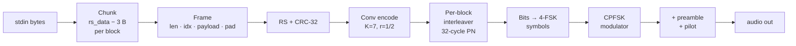
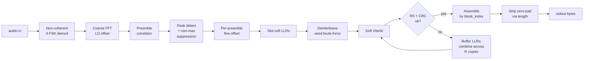

# weaklink

Streaming digital modem: bytes on stdin → audio → bytes on stdout. Works
with `tail -f`; no memory buffering, no wait-for-EOF.


Distribution: `weaklink-9a3ice`.

---

## Install

Portable Linux binary:

```bash
sudo apt install libportaudio2 libsndfile1
curl -L -O https://github.com/ivica3730k/weaklink-9a3ice/releases/latest/download/weaklink-9a3ice-linux-x86_64-latest
chmod +x weaklink-9a3ice-linux-x86_64-latest
```

Debian / Ubuntu `.deb`:

```bash
curl -L -O https://github.com/ivica3730k/weaklink-9a3ice/releases/latest/download/weaklink-9a3ice_amd64-latest.deb
sudo dpkg -i weaklink-9a3ice_amd64-latest.deb
```

From source:

```bash
poetry install
poetry run weaklink-9a3ice --version
```

---

## Quickstart

```bash
# WAV roundtrip
echo -n "hello weaklink" | weaklink-9a3ice tx --modem-wav /tmp/hello.wav
weaklink-9a3ice rx --modem-wav /tmp/hello.wav

# Live speaker → mic
weaklink-9a3ice rx > out.txt &
echo -n "over the room" | weaklink-9a3ice tx

# Long-lived stream
tail -f /var/log/syslog | weaklink-9a3ice tx --modem-baud 300
```

Both sides must use the same `--modem-baud` (no handshake).

---

## Presets

Three baud rates. Every preset carries 13 B of payload per RS block
(RS(16,8) + CRC-32), so message sizes map identically across bauds.

| Baud | CLI (both tx / rx) | 4-FSK tones (Hz) | Bandwidth | Default repeats | Measured best SNR | Min live tx (13 B payload) |
|---:|---|---|---:|---:|---:|---:|
| 45 | `--modem-baud 45` | 1200 / 1400 / 1600 / 1800 | 600 Hz | 4× | ≈ −14 dB | 28 s |
| 300 | `--modem-baud 300` | 1050 / 1350 / 1650 / 1950 | 900 Hz | 2× | ≈ −5 dB | 2.4 s |
| 1200 | `--modem-baud 1200` | 500 / 1700 / 2900 / 4100 | 3600 Hz | 2× | ≈ +2 dB | 1.0 s |

SNR is measured with AWGN normalised to a 3 kHz reference band — a
cross-baud comparison convention, not a physical channel filter.

Override `--modem-block-repeats N` on both sides for more copies. Each
doubling buys ~2–3 dB via soft-LLR combining, at proportional air time.

---

## Debugging live audio

`weaklink-9a3ice rx --modem-debug > out.txt` writes diagnostics to
`log.txt` (stdout stays clean for piping). Watch for:

- `audio: peak +X dBFS` below −40 dBFS → wrong mic or gain too low.
- `RS corrected` — outer code saved a block.
- `N slot(s) failed CRC/RS` — unrecoverable, data lost.
- macOS mic AGC / voice-isolation destroys tones; disable in System Settings.

---

## Full SNR sweep

Every baud × num_tones × RS × repeats combo is measured in
[`results.md`](results.md). Re-run `poetry run weaklink-benchmark` to
refresh.

---

## CLI reference

| Flag | Default | Description |
|------|---------|-------------|
| `--modem-baud N` | `300` | Symbol rate. Only `45`, `300`, `1200` supported. |
| `--modem-num-tones M` | `4` | M-FSK order: 2 / 4 / 8 / 16 / 32. Higher packs more bits per symbol at wider bandwidth and worse cliff. 2 halves throughput but fits narrow audio paths (e.g. FM voice via SignaLink). TX and RX must match. |
| `--modem-rs-data-bytes N` | preset | Reed-Solomon data bytes per block. |
| `--modem-rs-parity-bytes N` | preset | RS parity bytes. Corrects up to N/2 byte errors per block. |
| `--modem-no-rs-crc` | CRC on | Skip the CRC-32 inside each RS block. |
| `--modem-block-repeats N` | preset | N copies per block, each permuted differently; RX soft-combines LLRs. |
| `--modem-wav PATH` | live | WAV file instead of live audio. |
| `--modem-audio-output NAME` | OS default | tx audio target: sounddevice index, name substring, or Pulse sink. |
| `--modem-audio-input NAME` | OS default | rx audio source: same syntax; Pulse sources like `virt.monitor` supported. |
| `--modem-debug` | off | Verbose DEBUG chatter in the log file. |
| `--modem-log-file PATH` | `./log.txt` | Diagnostics land here. |

---

## How it works

### TX signal chain



### RX signal chain



Every slot is bracketed by a preamble, so any single slot decodes
standalone. Spurious mid-stream peaks get dropped. Message boundaries
between separate tx sessions are inferred from non-block-length spans
between preambles — one rx pipe can watch many tx sessions in a row.

### Wire format

```
One tx session (live audio):

  ┌────────┬─────┬────────┬─────┬────────┬─────┬─────┬────────┬─────┬────────┐
  │ pilot  │ pre │ slot 0 │ pre │ slot 1 │ pre │ ... │slot N-1│ pre │ pilot  │
  └────────┴─────┴────────┴─────┴────────┴─────┴─────┴────────┴─────┴────────┘

One RS block, data area (before conv + interleave + FSK):

  ┌── 1B ──┬── 2B ────┬──── rs_data − 3 B ────┬── 4B CRC ──┬── rs_parity B ──┐
  │ length │block_idx │ payload (zero-padded) │  CRC-32    │  RS parity      │
  └────────┴──────────┴───────────────────────┴────────────┴─────────────────┘
```

`block_idx` is 2 bytes → one tx session is bounded at 65 535 slots.

---

## Testing

```bash
poetry run pytest -q            # ~2 min, full suite
```

Every batch-decode test has an e2e-streaming companion that drives audio
through the same `_StreamingRxPump` the CLI uses.

---

## Glossary

- **4-FSK / CPFSK** — Four continuous-phase tones, 2 bits per tone.
- **Preamble** — Fixed 32-symbol PN sequence bracketing every slot; RX locks timing / frequency / amplitude from it.
- **Slot** — Preamble + one RS-encoded block.
- **Block** — RS-encoded chunk carrying header + payload.
- **RS(N,K)** — Reed-Solomon outer code. K data + parity → N wire bytes; corrects (N-K)/2 byte errors.
- **CRC-32** — Catches errors past RS correction.
- **Convolutional code (K=7, r=1/2) + soft Viterbi** — Inner FEC and its decoder, driven by per-bit LLRs.
- **Interleaver** — Bit shuffle so bursts become isolated errors. Ours changes every block (32-permutation cycle).
- **Non-coherent demod** — Tone detection by energy; ~3 dB behind coherent.
- **LO offset** — Radio frequency error; we correct up to ±500 Hz.
- **Pilot** — Short random 4-FSK burst before / after every live TX.

---

## Roadmap

- **Coherent detection** — Costas-loop demod, ~3 dB gain. Big DSP lift.
- **LDPC** — Closes ~2–4 dB of the Shannon gap. Needs a proper construction.

---

## License

MIT. See `LICENSE`.

Reed-Solomon via [`reedsolo`](https://github.com/tomerfiliba-org/reedsolomon).
Convolutional code uses the standard NASA/CCSDS (171, 133) generator
polynomials. Audio via [`sounddevice`](https://github.com/spatialaudio/python-sounddevice)
and [`soundfile`](https://github.com/bastibe/python-soundfile).
