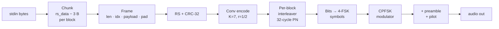
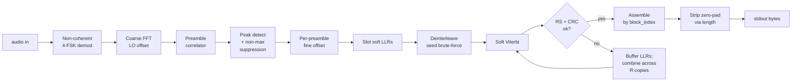

# weaklink

Streaming digital modem: bytes on stdin → audio → bytes on stdout. Works
with `tail -f`; no memory buffering, no wait-for-EOF.


Distribution: `weaklink-9a3ice`.

---

## Install

Portable Linux binary:

```bash
sudo apt install libportaudio2 libsndfile1
curl -L -O https://github.com/ivica3730k/weaklink-9a3ice/releases/latest/download/weaklink-9a3ice-linux-x86_64-latest
chmod +x weaklink-9a3ice-linux-x86_64-latest
```

Debian / Ubuntu `.deb`:

```bash
curl -L -O https://github.com/ivica3730k/weaklink-9a3ice/releases/latest/download/weaklink-9a3ice_amd64-latest.deb
sudo dpkg -i weaklink-9a3ice_amd64-latest.deb
```

From source:

```bash
poetry install
poetry run weaklink-9a3ice --version
```

---

## Quickstart

```bash
# WAV roundtrip
echo -n "hello weaklink" | weaklink-9a3ice tx --modem-wav /tmp/hello.wav
weaklink-9a3ice rx --modem-wav /tmp/hello.wav

# Live speaker → mic
weaklink-9a3ice rx > out.txt &
echo -n "over the room" | weaklink-9a3ice tx

# Long-lived stream
tail -f /var/log/syslog | weaklink-9a3ice tx --modem-baud 300
```

Both sides must use the same `--modem-baud` (no handshake).

---

## Presets

Three baud rates. Every preset carries 13 B of payload per RS block
(RS(16,8) + CRC-32), so message sizes map identically across bauds.

| Baud | CLI (both tx / rx) | 4-FSK tones (Hz) | Bandwidth | Default repeats | Measured best SNR | Min live tx (13 B payload) |
|---:|---|---|---:|---:|---:|---:|
| 45 | `--modem-baud 45` | 1200 / 1400 / 1600 / 1800 | 600 Hz | 4× | ≈ −14 dB | 28 s |
| 300 | `--modem-baud 300` | 1050 / 1350 / 1650 / 1950 | 900 Hz | 2× | ≈ −5 dB | 2.4 s |
| 1200 | `--modem-baud 1200` | 500 / 1700 / 2900 / 4100 | 3600 Hz | 2× | ≈ +2 dB | 1.0 s |

SNR is measured with AWGN normalised to a 3 kHz reference band — a
cross-baud comparison convention, not a physical channel filter.

Override `--modem-block-repeats N` on both sides for more copies. Each
doubling buys ~2–3 dB via soft-LLR combining, at proportional air time.

---

## Debugging live audio

`weaklink-9a3ice rx --modem-debug > out.txt` writes diagnostics to
`log.txt` (stdout stays clean for piping). Watch for:

- `audio: peak +X dBFS` below −40 dBFS → wrong mic or gain too low.
- `RS corrected` — outer code saved a block.
- `N slot(s) failed CRC/RS` — unrecoverable, data lost.
- macOS mic AGC / voice-isolation destroys tones; disable in System Settings.

---

## SNR benchmarks

Auto-generated. Re-run `poetry run weaklink-benchmark` to refresh the
tables between the markers.

<!-- BENCHMARK RESULTS START -->

Streaming modem. Payload: 100 random-ASCII bytes. Sync every 4 data blocks. Reference bandwidth: 3 kHz.

| Baud | Tones | CLI (both tx / rx) | Throughput | Info rate | Measured best SNR |
|---:|---:|---|---|---:|---:|
| 45 | 2 | `--modem-baud 45`<br/>`--modem-num-tones 2`<br/>`--modem-rs-data-bytes 16`<br/>`--modem-rs-parity-bytes 8`<br/>`--modem-block-repeats 1` | 100 chars in 97.4 s | 8.2 bit/s | **+9 dB** |
| 45 | 4 | `--modem-baud 45`<br/>`--modem-num-tones 4`<br/>`--modem-rs-data-bytes 16`<br/>`--modem-rs-parity-bytes 8`<br/>`--modem-block-repeats 1` | 100 chars in 51.9 s | 15.4 bit/s | **-12 dB** |
| 45 | 8 | `--modem-baud 45`<br/>`--modem-num-tones 8`<br/>`--modem-rs-data-bytes 16`<br/>`--modem-rs-parity-bytes 8`<br/>`--modem-block-repeats 1` | 100 chars in 36.8 s | 21.7 bit/s | **-11 dB** |
| 45 | 16 | `--modem-baud 45`<br/>`--modem-num-tones 16`<br/>`--modem-rs-data-bytes 16`<br/>`--modem-rs-parity-bytes 8`<br/>`--modem-block-repeats 1` | 100 chars in 29.2 s | 27.4 bit/s | **-10 dB** |
| 45 | 32 | `--modem-baud 45`<br/>`--modem-num-tones 32`<br/>`--modem-rs-data-bytes 16`<br/>`--modem-rs-parity-bytes 8`<br/>`--modem-block-repeats 1` | 100 chars in 24.7 s | 32.4 bit/s | **-10 dB** |
| 45 | 2 | `--modem-baud 45`<br/>`--modem-num-tones 2`<br/>`--modem-rs-data-bytes 16`<br/>`--modem-rs-parity-bytes 8`<br/>`--modem-block-repeats 2` | 100 chars in 194.1 s | 4.1 bit/s | **-12 dB** |
| 45 | 4 | `--modem-baud 45`<br/>`--modem-num-tones 4`<br/>`--modem-rs-data-bytes 16`<br/>`--modem-rs-parity-bytes 8`<br/>`--modem-block-repeats 2` | 100 chars in 103.1 s | 7.8 bit/s | **-13 dB** |
| 45 | 8 | `--modem-baud 45`<br/>`--modem-num-tones 8`<br/>`--modem-rs-data-bytes 16`<br/>`--modem-rs-parity-bytes 8`<br/>`--modem-block-repeats 2` | 100 chars in 72.9 s | 11.0 bit/s | **-12 dB** |
| 45 | 16 | `--modem-baud 45`<br/>`--modem-num-tones 16`<br/>`--modem-rs-data-bytes 16`<br/>`--modem-rs-parity-bytes 8`<br/>`--modem-block-repeats 2` | 100 chars in 57.6 s | 13.9 bit/s | **-11 dB** |
| 45 | 32 | `--modem-baud 45`<br/>`--modem-num-tones 32`<br/>`--modem-rs-data-bytes 16`<br/>`--modem-rs-parity-bytes 8`<br/>`--modem-block-repeats 2` | 100 chars in 48.7 s | 16.4 bit/s | **-10 dB** |
| 45 | 2 | `--modem-baud 45`<br/>`--modem-num-tones 2`<br/>`--modem-rs-data-bytes 16`<br/>`--modem-rs-parity-bytes 8`<br/>`--modem-block-repeats 4` | 100 chars in 387.6 s | 2.1 bit/s | **+10 dB** |
| 45 | 4 | `--modem-baud 45`<br/>`--modem-num-tones 4`<br/>`--modem-rs-data-bytes 16`<br/>`--modem-rs-parity-bytes 8`<br/>`--modem-block-repeats 4` | 100 chars in 205.5 s | 3.9 bit/s | **-13 dB** |
| 45 | 8 | `--modem-baud 45`<br/>`--modem-num-tones 8`<br/>`--modem-rs-data-bytes 16`<br/>`--modem-rs-parity-bytes 8`<br/>`--modem-block-repeats 4` | 100 chars in 145.1 s | 5.5 bit/s | **-12 dB** |
| 45 | 16 | `--modem-baud 45`<br/>`--modem-num-tones 16`<br/>`--modem-rs-data-bytes 16`<br/>`--modem-rs-parity-bytes 8`<br/>`--modem-block-repeats 4` | 100 chars in 114.5 s | 7.0 bit/s | **-11 dB** |
| 45 | 32 | `--modem-baud 45`<br/>`--modem-num-tones 32`<br/>`--modem-rs-data-bytes 16`<br/>`--modem-rs-parity-bytes 8`<br/>`--modem-block-repeats 4` | 100 chars in 96.7 s | 8.3 bit/s | **-11 dB** |
| 45 | 2 | `--modem-baud 45`<br/>`--modem-num-tones 2`<br/>`--modem-rs-data-bytes 16`<br/>`--modem-rs-parity-bytes 8`<br/>`--modem-block-repeats 8` | 100 chars in 774.4 s | 1.0 bit/s | **+8 dB** |
| 45 | 4 | `--modem-baud 45`<br/>`--modem-num-tones 4`<br/>`--modem-rs-data-bytes 16`<br/>`--modem-rs-parity-bytes 8`<br/>`--modem-block-repeats 8` | 100 chars in 410.3 s | 1.9 bit/s | **-12 dB** |
| 45 | 8 | `--modem-baud 45`<br/>`--modem-num-tones 8`<br/>`--modem-rs-data-bytes 16`<br/>`--modem-rs-parity-bytes 8`<br/>`--modem-block-repeats 8` | 100 chars in 289.4 s | 2.8 bit/s | **-12 dB** |
| 45 | 16 | `--modem-baud 45`<br/>`--modem-num-tones 16`<br/>`--modem-rs-data-bytes 16`<br/>`--modem-rs-parity-bytes 8`<br/>`--modem-block-repeats 8` | 100 chars in 228.3 s | 3.5 bit/s | **-12 dB** |
| 45 | 32 | `--modem-baud 45`<br/>`--modem-num-tones 32`<br/>`--modem-rs-data-bytes 16`<br/>`--modem-rs-parity-bytes 8`<br/>`--modem-block-repeats 8` | 100 chars in 192.7 s | 4.2 bit/s | **-11 dB** |
| 45 | 2 | `--modem-baud 45`<br/>`--modem-num-tones 2`<br/>`--modem-rs-data-bytes 32`<br/>`--modem-rs-parity-bytes 8`<br/>`--modem-block-repeats 1` | 100 chars in 71.8 s | 11.1 bit/s | not reached |
| 45 | 4 | `--modem-baud 45`<br/>`--modem-num-tones 4`<br/>`--modem-rs-data-bytes 32`<br/>`--modem-rs-parity-bytes 8`<br/>`--modem-block-repeats 1` | 100 chars in 37.7 s | 21.2 bit/s | **-12 dB** |
| 45 | 8 | `--modem-baud 45`<br/>`--modem-num-tones 8`<br/>`--modem-rs-data-bytes 32`<br/>`--modem-rs-parity-bytes 8`<br/>`--modem-block-repeats 1` | 100 chars in 26.3 s | 30.4 bit/s | **-11 dB** |
| 45 | 16 | `--modem-baud 45`<br/>`--modem-num-tones 16`<br/>`--modem-rs-data-bytes 32`<br/>`--modem-rs-parity-bytes 8`<br/>`--modem-block-repeats 1` | 100 chars in 20.6 s | 38.8 bit/s | **-11 dB** |
| 45 | 32 | `--modem-baud 45`<br/>`--modem-num-tones 32`<br/>`--modem-rs-data-bytes 32`<br/>`--modem-rs-parity-bytes 8`<br/>`--modem-block-repeats 1` | 100 chars in 17.2 s | 46.4 bit/s | **-10 dB** |
| 45 | 2 | `--modem-baud 45`<br/>`--modem-num-tones 2`<br/>`--modem-rs-data-bytes 32`<br/>`--modem-rs-parity-bytes 8`<br/>`--modem-block-repeats 2` | 100 chars in 142.9 s | 5.6 bit/s | not reached |
| 45 | 4 | `--modem-baud 45`<br/>`--modem-num-tones 4`<br/>`--modem-rs-data-bytes 32`<br/>`--modem-rs-parity-bytes 8`<br/>`--modem-block-repeats 2` | 100 chars in 74.7 s | 10.7 bit/s | **-13 dB** |
| 45 | 8 | `--modem-baud 45`<br/>`--modem-num-tones 8`<br/>`--modem-rs-data-bytes 32`<br/>`--modem-rs-parity-bytes 8`<br/>`--modem-block-repeats 2` | 100 chars in 51.9 s | 15.4 bit/s | **-12 dB** |
| 45 | 16 | `--modem-baud 45`<br/>`--modem-num-tones 16`<br/>`--modem-rs-data-bytes 32`<br/>`--modem-rs-parity-bytes 8`<br/>`--modem-block-repeats 2` | 100 chars in 40.5 s | 19.7 bit/s | **-11 dB** |
| 45 | 32 | `--modem-baud 45`<br/>`--modem-num-tones 32`<br/>`--modem-rs-data-bytes 32`<br/>`--modem-rs-parity-bytes 8`<br/>`--modem-block-repeats 2` | 100 chars in 33.8 s | 23.7 bit/s | **-10 dB** |
| 45 | 2 | `--modem-baud 45`<br/>`--modem-num-tones 2`<br/>`--modem-rs-data-bytes 32`<br/>`--modem-rs-parity-bytes 8`<br/>`--modem-block-repeats 4` | 100 chars in 285.2 s | 2.8 bit/s | not reached |
| 45 | 4 | `--modem-baud 45`<br/>`--modem-num-tones 4`<br/>`--modem-rs-data-bytes 32`<br/>`--modem-rs-parity-bytes 8`<br/>`--modem-block-repeats 4` | 100 chars in 148.6 s | 5.4 bit/s | **-13 dB** |
| 45 | 8 | `--modem-baud 45`<br/>`--modem-num-tones 8`<br/>`--modem-rs-data-bytes 32`<br/>`--modem-rs-parity-bytes 8`<br/>`--modem-block-repeats 4` | 100 chars in 103.1 s | 7.8 bit/s | **-12 dB** |
| 45 | 16 | `--modem-baud 45`<br/>`--modem-num-tones 16`<br/>`--modem-rs-data-bytes 32`<br/>`--modem-rs-parity-bytes 8`<br/>`--modem-block-repeats 4` | 100 chars in 80.4 s | 10.0 bit/s | **-11 dB** |
| 45 | 32 | `--modem-baud 45`<br/>`--modem-num-tones 32`<br/>`--modem-rs-data-bytes 32`<br/>`--modem-rs-parity-bytes 8`<br/>`--modem-block-repeats 4` | 100 chars in 66.8 s | 12.0 bit/s | **-10 dB** |
| 45 | 2 | `--modem-baud 45`<br/>`--modem-num-tones 2`<br/>`--modem-rs-data-bytes 32`<br/>`--modem-rs-parity-bytes 8`<br/>`--modem-block-repeats 8` | 100 chars in 569.6 s | 1.4 bit/s | not reached |
| 45 | 4 | `--modem-baud 45`<br/>`--modem-num-tones 4`<br/>`--modem-rs-data-bytes 32`<br/>`--modem-rs-parity-bytes 8`<br/>`--modem-block-repeats 8` | 100 chars in 296.5 s | 2.7 bit/s | **-13 dB** |
| 45 | 8 | `--modem-baud 45`<br/>`--modem-num-tones 8`<br/>`--modem-rs-data-bytes 32`<br/>`--modem-rs-parity-bytes 8`<br/>`--modem-block-repeats 8` | 100 chars in 205.5 s | 3.9 bit/s | **-12 dB** |
| 45 | 16 | `--modem-baud 45`<br/>`--modem-num-tones 16`<br/>`--modem-rs-data-bytes 32`<br/>`--modem-rs-parity-bytes 8`<br/>`--modem-block-repeats 8` | 100 chars in 160.0 s | 5.0 bit/s | **-11 dB** |
| 45 | 32 | `--modem-baud 45`<br/>`--modem-num-tones 32`<br/>`--modem-rs-data-bytes 32`<br/>`--modem-rs-parity-bytes 8`<br/>`--modem-block-repeats 8` | 100 chars in 133.0 s | 6.0 bit/s | **-13 dB** |
| 45 | 2 | `--modem-baud 45`<br/>`--modem-num-tones 2`<br/>`--modem-rs-data-bytes 128`<br/>`--modem-rs-parity-bytes 32`<br/>`--modem-block-repeats 1` | 100 chars in 64.0 s | 12.5 bit/s | **+10 dB** |
| 45 | 4 | `--modem-baud 45`<br/>`--modem-num-tones 4`<br/>`--modem-rs-data-bytes 128`<br/>`--modem-rs-parity-bytes 32`<br/>`--modem-block-repeats 1` | 100 chars in 32.7 s | 24.5 bit/s | **-13 dB** |
| 45 | 8 | `--modem-baud 45`<br/>`--modem-num-tones 8`<br/>`--modem-rs-data-bytes 128`<br/>`--modem-rs-parity-bytes 32`<br/>`--modem-block-repeats 1` | 100 chars in 22.3 s | 35.9 bit/s | **-11 dB** |
| 45 | 16 | `--modem-baud 45`<br/>`--modem-num-tones 16`<br/>`--modem-rs-data-bytes 128`<br/>`--modem-rs-parity-bytes 32`<br/>`--modem-block-repeats 1` | 100 chars in 17.1 s | 46.9 bit/s | **-11 dB** |
| 45 | 32 | `--modem-baud 45`<br/>`--modem-num-tones 32`<br/>`--modem-rs-data-bytes 128`<br/>`--modem-rs-parity-bytes 32`<br/>`--modem-block-repeats 1` | 100 chars in 14.0 s | 57.3 bit/s | **-6 dB** |
| 45 | 2 | `--modem-baud 45`<br/>`--modem-num-tones 2`<br/>`--modem-rs-data-bytes 128`<br/>`--modem-rs-parity-bytes 32`<br/>`--modem-block-repeats 2` | 100 chars in 127.3 s | 6.3 bit/s | **+8 dB** |
| 45 | 4 | `--modem-baud 45`<br/>`--modem-num-tones 4`<br/>`--modem-rs-data-bytes 128`<br/>`--modem-rs-parity-bytes 32`<br/>`--modem-block-repeats 2` | 100 chars in 64.7 s | 12.4 bit/s | **-14 dB** |
| 45 | 8 | `--modem-baud 45`<br/>`--modem-num-tones 8`<br/>`--modem-rs-data-bytes 128`<br/>`--modem-rs-parity-bytes 32`<br/>`--modem-block-repeats 2` | 100 chars in 43.9 s | 18.2 bit/s | **-13 dB** |
| 45 | 16 | `--modem-baud 45`<br/>`--modem-num-tones 16`<br/>`--modem-rs-data-bytes 128`<br/>`--modem-rs-parity-bytes 32`<br/>`--modem-block-repeats 2` | 100 chars in 33.4 s | 23.9 bit/s | **-12 dB** |
| 45 | 32 | `--modem-baud 45`<br/>`--modem-num-tones 32`<br/>`--modem-rs-data-bytes 128`<br/>`--modem-rs-parity-bytes 32`<br/>`--modem-block-repeats 2` | 100 chars in 27.2 s | 29.4 bit/s | **-12 dB** |
| 45 | 2 | `--modem-baud 45`<br/>`--modem-num-tones 2`<br/>`--modem-rs-data-bytes 128`<br/>`--modem-rs-parity-bytes 32`<br/>`--modem-block-repeats 4` | 100 chars in 253.9 s | 3.2 bit/s | **+5 dB** |
| 45 | 4 | `--modem-baud 45`<br/>`--modem-num-tones 4`<br/>`--modem-rs-data-bytes 128`<br/>`--modem-rs-parity-bytes 32`<br/>`--modem-block-repeats 4` | 100 chars in 128.7 s | 6.2 bit/s | **-14 dB** |
| 45 | 8 | `--modem-baud 45`<br/>`--modem-num-tones 8`<br/>`--modem-rs-data-bytes 128`<br/>`--modem-rs-parity-bytes 32`<br/>`--modem-block-repeats 4` | 100 chars in 87.0 s | 9.2 bit/s | **-13 dB** |
| 45 | 16 | `--modem-baud 45`<br/>`--modem-num-tones 16`<br/>`--modem-rs-data-bytes 128`<br/>`--modem-rs-parity-bytes 32`<br/>`--modem-block-repeats 4` | 100 chars in 66.1 s | 12.1 bit/s | **-14 dB** |
| 45 | 32 | `--modem-baud 45`<br/>`--modem-num-tones 32`<br/>`--modem-rs-data-bytes 128`<br/>`--modem-rs-parity-bytes 32`<br/>`--modem-block-repeats 4` | 100 chars in 53.7 s | 14.9 bit/s | **-10 dB** |
| 45 | 2 | `--modem-baud 45`<br/>`--modem-num-tones 2`<br/>`--modem-rs-data-bytes 128`<br/>`--modem-rs-parity-bytes 32`<br/>`--modem-block-repeats 8` | 100 chars in 507.0 s | 1.6 bit/s | **+3 dB** |
| 45 | 4 | `--modem-baud 45`<br/>`--modem-num-tones 4`<br/>`--modem-rs-data-bytes 128`<br/>`--modem-rs-parity-bytes 32`<br/>`--modem-block-repeats 8` | 100 chars in 256.7 s | 3.1 bit/s | **-14 dB** |
| 45 | 8 | `--modem-baud 45`<br/>`--modem-num-tones 8`<br/>`--modem-rs-data-bytes 128`<br/>`--modem-rs-parity-bytes 32`<br/>`--modem-block-repeats 8` | 100 chars in 173.3 s | 4.6 bit/s | **-12 dB** |
| 45 | 16 | `--modem-baud 45`<br/>`--modem-num-tones 16`<br/>`--modem-rs-data-bytes 128`<br/>`--modem-rs-parity-bytes 32`<br/>`--modem-block-repeats 8` | 100 chars in 131.6 s | 6.1 bit/s | **-13 dB** |
| 45 | 32 | `--modem-baud 45`<br/>`--modem-num-tones 32`<br/>`--modem-rs-data-bytes 128`<br/>`--modem-rs-parity-bytes 32`<br/>`--modem-block-repeats 8` | 100 chars in 106.7 s | 7.5 bit/s | **-13 dB** |
| 300 | 2 | `--modem-baud 300`<br/>`--modem-num-tones 2`<br/>`--modem-rs-data-bytes 16`<br/>`--modem-rs-parity-bytes 8`<br/>`--modem-block-repeats 1` | 100 chars in 14.6 s | 54.7 bit/s | **+5 dB** |
| 300 | 4 | `--modem-baud 300`<br/>`--modem-num-tones 4`<br/>`--modem-rs-data-bytes 16`<br/>`--modem-rs-parity-bytes 8`<br/>`--modem-block-repeats 1` | 100 chars in 7.8 s | 102.7 bit/s | **-4 dB** |
| 300 | 8 | `--modem-baud 300`<br/>`--modem-num-tones 8`<br/>`--modem-rs-data-bytes 16`<br/>`--modem-rs-parity-bytes 8`<br/>`--modem-block-repeats 1` | 100 chars in 5.5 s | 144.9 bit/s | **-3 dB** |
| 300 | 16 | `--modem-baud 300`<br/>`--modem-num-tones 16`<br/>`--modem-rs-data-bytes 16`<br/>`--modem-rs-parity-bytes 8`<br/>`--modem-block-repeats 1` | 100 chars in 4.4 s | 182.9 bit/s | **-2 dB** |
| 300 | 2 | `--modem-baud 300`<br/>`--modem-num-tones 2`<br/>`--modem-rs-data-bytes 16`<br/>`--modem-rs-parity-bytes 8`<br/>`--modem-block-repeats 2` | 100 chars in 29.1 s | 27.5 bit/s | **-4 dB** |
| 300 | 4 | `--modem-baud 300`<br/>`--modem-num-tones 4`<br/>`--modem-rs-data-bytes 16`<br/>`--modem-rs-parity-bytes 8`<br/>`--modem-block-repeats 2` | 100 chars in 15.5 s | 51.7 bit/s | **-4 dB** |
| 300 | 8 | `--modem-baud 300`<br/>`--modem-num-tones 8`<br/>`--modem-rs-data-bytes 16`<br/>`--modem-rs-parity-bytes 8`<br/>`--modem-block-repeats 2` | 100 chars in 10.9 s | 73.2 bit/s | **-5 dB** |
| 300 | 16 | `--modem-baud 300`<br/>`--modem-num-tones 16`<br/>`--modem-rs-data-bytes 16`<br/>`--modem-rs-parity-bytes 8`<br/>`--modem-block-repeats 2` | 100 chars in 8.6 s | 92.6 bit/s | **-3 dB** |
| 300 | 2 | `--modem-baud 300`<br/>`--modem-num-tones 2`<br/>`--modem-rs-data-bytes 16`<br/>`--modem-rs-parity-bytes 8`<br/>`--modem-block-repeats 4` | 100 chars in 58.1 s | 13.8 bit/s | **-5 dB** |
| 300 | 4 | `--modem-baud 300`<br/>`--modem-num-tones 4`<br/>`--modem-rs-data-bytes 16`<br/>`--modem-rs-parity-bytes 8`<br/>`--modem-block-repeats 4` | 100 chars in 30.8 s | 26.0 bit/s | **-4 dB** |
| 300 | 8 | `--modem-baud 300`<br/>`--modem-num-tones 8`<br/>`--modem-rs-data-bytes 16`<br/>`--modem-rs-parity-bytes 8`<br/>`--modem-block-repeats 4` | 100 chars in 21.8 s | 36.8 bit/s | **-4 dB** |
| 300 | 16 | `--modem-baud 300`<br/>`--modem-num-tones 16`<br/>`--modem-rs-data-bytes 16`<br/>`--modem-rs-parity-bytes 8`<br/>`--modem-block-repeats 4` | 100 chars in 17.2 s | 46.6 bit/s | **-3 dB** |
| 300 | 2 | `--modem-baud 300`<br/>`--modem-num-tones 2`<br/>`--modem-rs-data-bytes 16`<br/>`--modem-rs-parity-bytes 8`<br/>`--modem-block-repeats 8` | 100 chars in 116.2 s | 6.9 bit/s | **-2 dB** |
| 300 | 4 | `--modem-baud 300`<br/>`--modem-num-tones 4`<br/>`--modem-rs-data-bytes 16`<br/>`--modem-rs-parity-bytes 8`<br/>`--modem-block-repeats 8` | 100 chars in 61.5 s | 13.0 bit/s | **-5 dB** |
| 300 | 8 | `--modem-baud 300`<br/>`--modem-num-tones 8`<br/>`--modem-rs-data-bytes 16`<br/>`--modem-rs-parity-bytes 8`<br/>`--modem-block-repeats 8` | 100 chars in 43.4 s | 18.4 bit/s | **-4 dB** |
| 300 | 16 | `--modem-baud 300`<br/>`--modem-num-tones 16`<br/>`--modem-rs-data-bytes 16`<br/>`--modem-rs-parity-bytes 8`<br/>`--modem-block-repeats 8` | 100 chars in 34.2 s | 23.4 bit/s | **-3 dB** |
| 300 | 2 | `--modem-baud 300`<br/>`--modem-num-tones 2`<br/>`--modem-rs-data-bytes 32`<br/>`--modem-rs-parity-bytes 8`<br/>`--modem-block-repeats 1` | 100 chars in 10.8 s | 74.3 bit/s | not reached |
| 300 | 4 | `--modem-baud 300`<br/>`--modem-num-tones 4`<br/>`--modem-rs-data-bytes 32`<br/>`--modem-rs-parity-bytes 8`<br/>`--modem-block-repeats 1` | 100 chars in 5.7 s | 141.5 bit/s | **-4 dB** |
| 300 | 8 | `--modem-baud 300`<br/>`--modem-num-tones 8`<br/>`--modem-rs-data-bytes 32`<br/>`--modem-rs-parity-bytes 8`<br/>`--modem-block-repeats 1` | 100 chars in 3.9 s | 202.7 bit/s | **-3 dB** |
| 300 | 16 | `--modem-baud 300`<br/>`--modem-num-tones 16`<br/>`--modem-rs-data-bytes 32`<br/>`--modem-rs-parity-bytes 8`<br/>`--modem-block-repeats 1` | 100 chars in 3.1 s | 258.6 bit/s | **-2 dB** |
| 300 | 2 | `--modem-baud 300`<br/>`--modem-num-tones 2`<br/>`--modem-rs-data-bytes 32`<br/>`--modem-rs-parity-bytes 8`<br/>`--modem-block-repeats 2` | 100 chars in 21.4 s | 37.3 bit/s | **-4 dB** |
| 300 | 4 | `--modem-baud 300`<br/>`--modem-num-tones 4`<br/>`--modem-rs-data-bytes 32`<br/>`--modem-rs-parity-bytes 8`<br/>`--modem-block-repeats 2` | 100 chars in 11.2 s | 71.4 bit/s | **-4 dB** |
| 300 | 8 | `--modem-baud 300`<br/>`--modem-num-tones 8`<br/>`--modem-rs-data-bytes 32`<br/>`--modem-rs-parity-bytes 8`<br/>`--modem-block-repeats 2` | 100 chars in 7.8 s | 102.7 bit/s | **-5 dB** |
| 300 | 16 | `--modem-baud 300`<br/>`--modem-num-tones 16`<br/>`--modem-rs-data-bytes 32`<br/>`--modem-rs-parity-bytes 8`<br/>`--modem-block-repeats 2` | 100 chars in 6.1 s | 131.6 bit/s | **-2 dB** |
| 300 | 2 | `--modem-baud 300`<br/>`--modem-num-tones 2`<br/>`--modem-rs-data-bytes 32`<br/>`--modem-rs-parity-bytes 8`<br/>`--modem-block-repeats 4` | 100 chars in 42.8 s | 18.7 bit/s | not reached |
| 300 | 4 | `--modem-baud 300`<br/>`--modem-num-tones 4`<br/>`--modem-rs-data-bytes 32`<br/>`--modem-rs-parity-bytes 8`<br/>`--modem-block-repeats 4` | 100 chars in 22.3 s | 35.9 bit/s | **-4 dB** |
| 300 | 8 | `--modem-baud 300`<br/>`--modem-num-tones 8`<br/>`--modem-rs-data-bytes 32`<br/>`--modem-rs-parity-bytes 8`<br/>`--modem-block-repeats 4` | 100 chars in 15.5 s | 51.7 bit/s | **-4 dB** |
| 300 | 16 | `--modem-baud 300`<br/>`--modem-num-tones 16`<br/>`--modem-rs-data-bytes 32`<br/>`--modem-rs-parity-bytes 8`<br/>`--modem-block-repeats 4` | 100 chars in 12.1 s | 66.4 bit/s | **-5 dB** |
| 300 | 2 | `--modem-baud 300`<br/>`--modem-num-tones 2`<br/>`--modem-rs-data-bytes 32`<br/>`--modem-rs-parity-bytes 8`<br/>`--modem-block-repeats 8` | 100 chars in 85.4 s | 9.4 bit/s | **+10 dB** |
| 300 | 4 | `--modem-baud 300`<br/>`--modem-num-tones 4`<br/>`--modem-rs-data-bytes 32`<br/>`--modem-rs-parity-bytes 8`<br/>`--modem-block-repeats 8` | 100 chars in 44.5 s | 18.0 bit/s | **-5 dB** |
| 300 | 8 | `--modem-baud 300`<br/>`--modem-num-tones 8`<br/>`--modem-rs-data-bytes 32`<br/>`--modem-rs-parity-bytes 8`<br/>`--modem-block-repeats 8` | 100 chars in 30.8 s | 26.0 bit/s | **-4 dB** |
| 300 | 16 | `--modem-baud 300`<br/>`--modem-num-tones 16`<br/>`--modem-rs-data-bytes 32`<br/>`--modem-rs-parity-bytes 8`<br/>`--modem-block-repeats 8` | 100 chars in 24.0 s | 33.3 bit/s | **-3 dB** |
| 300 | 2 | `--modem-baud 300`<br/>`--modem-num-tones 2`<br/>`--modem-rs-data-bytes 128`<br/>`--modem-rs-parity-bytes 32`<br/>`--modem-block-repeats 1` | 100 chars in 9.6 s | 83.3 bit/s | not reached |
| 300 | 4 | `--modem-baud 300`<br/>`--modem-num-tones 4`<br/>`--modem-rs-data-bytes 128`<br/>`--modem-rs-parity-bytes 32`<br/>`--modem-block-repeats 1` | 100 chars in 4.9 s | 163.0 bit/s | **-4 dB** |
| 300 | 8 | `--modem-baud 300`<br/>`--modem-num-tones 8`<br/>`--modem-rs-data-bytes 128`<br/>`--modem-rs-parity-bytes 32`<br/>`--modem-block-repeats 1` | 100 chars in 3.3 s | 239.3 bit/s | **-3 dB** |
| 300 | 16 | `--modem-baud 300`<br/>`--modem-num-tones 16`<br/>`--modem-rs-data-bytes 128`<br/>`--modem-rs-parity-bytes 32`<br/>`--modem-block-repeats 1` | 100 chars in 2.6 s | 312.5 bit/s | **-2 dB** |
| 300 | 2 | `--modem-baud 300`<br/>`--modem-num-tones 2`<br/>`--modem-rs-data-bytes 128`<br/>`--modem-rs-parity-bytes 32`<br/>`--modem-block-repeats 2` | 100 chars in 19.1 s | 41.9 bit/s | **+5 dB** |
| 300 | 4 | `--modem-baud 300`<br/>`--modem-num-tones 4`<br/>`--modem-rs-data-bytes 128`<br/>`--modem-rs-parity-bytes 32`<br/>`--modem-block-repeats 2` | 100 chars in 9.7 s | 82.4 bit/s | **-6 dB** |
| 300 | 8 | `--modem-baud 300`<br/>`--modem-num-tones 8`<br/>`--modem-rs-data-bytes 128`<br/>`--modem-rs-parity-bytes 32`<br/>`--modem-block-repeats 2` | 100 chars in 6.6 s | 121.6 bit/s | **-5 dB** |
| 300 | 16 | `--modem-baud 300`<br/>`--modem-num-tones 16`<br/>`--modem-rs-data-bytes 128`<br/>`--modem-rs-parity-bytes 32`<br/>`--modem-block-repeats 2` | 100 chars in 5.0 s | 159.6 bit/s | **-4 dB** |
| 300 | 2 | `--modem-baud 300`<br/>`--modem-num-tones 2`<br/>`--modem-rs-data-bytes 128`<br/>`--modem-rs-parity-bytes 32`<br/>`--modem-block-repeats 4` | 100 chars in 38.1 s | 21.0 bit/s | **+10 dB** |
| 300 | 4 | `--modem-baud 300`<br/>`--modem-num-tones 4`<br/>`--modem-rs-data-bytes 128`<br/>`--modem-rs-parity-bytes 32`<br/>`--modem-block-repeats 4` | 100 chars in 19.3 s | 41.4 bit/s | **-6 dB** |
| 300 | 8 | `--modem-baud 300`<br/>`--modem-num-tones 8`<br/>`--modem-rs-data-bytes 128`<br/>`--modem-rs-parity-bytes 32`<br/>`--modem-block-repeats 4` | 100 chars in 13.1 s | 61.3 bit/s | **-4 dB** |
| 300 | 16 | `--modem-baud 300`<br/>`--modem-num-tones 16`<br/>`--modem-rs-data-bytes 128`<br/>`--modem-rs-parity-bytes 32`<br/>`--modem-block-repeats 4` | 100 chars in 9.9 s | 80.6 bit/s | **-6 dB** |
| 300 | 2 | `--modem-baud 300`<br/>`--modem-num-tones 2`<br/>`--modem-rs-data-bytes 128`<br/>`--modem-rs-parity-bytes 32`<br/>`--modem-block-repeats 8` | 100 chars in 76.1 s | 10.5 bit/s | **+10 dB** |
| 300 | 4 | `--modem-baud 300`<br/>`--modem-num-tones 4`<br/>`--modem-rs-data-bytes 128`<br/>`--modem-rs-parity-bytes 32`<br/>`--modem-block-repeats 8` | 100 chars in 38.5 s | 20.8 bit/s | **-5 dB** |
| 300 | 8 | `--modem-baud 300`<br/>`--modem-num-tones 8`<br/>`--modem-rs-data-bytes 128`<br/>`--modem-rs-parity-bytes 32`<br/>`--modem-block-repeats 8` | 100 chars in 26.0 s | 30.8 bit/s | **-4 dB** |
| 300 | 16 | `--modem-baud 300`<br/>`--modem-num-tones 16`<br/>`--modem-rs-data-bytes 128`<br/>`--modem-rs-parity-bytes 32`<br/>`--modem-block-repeats 8` | 100 chars in 19.7 s | 40.5 bit/s | **-4 dB** |
| 1200 | 2 | `--modem-baud 1200`<br/>`--modem-num-tones 2`<br/>`--modem-rs-data-bytes 16`<br/>`--modem-rs-parity-bytes 8`<br/>`--modem-block-repeats 1` | 100 chars in 3.7 s | 219.0 bit/s | **+3 dB** |
| 1200 | 4 | `--modem-baud 1200`<br/>`--modem-num-tones 4`<br/>`--modem-rs-data-bytes 16`<br/>`--modem-rs-parity-bytes 8`<br/>`--modem-block-repeats 1` | 100 chars in 1.9 s | 411.0 bit/s | **+2 dB** |
| 1200 | 8 | `--modem-baud 1200`<br/>`--modem-num-tones 8`<br/>`--modem-rs-data-bytes 16`<br/>`--modem-rs-parity-bytes 8`<br/>`--modem-block-repeats 1` | 100 chars in 1.4 s | 579.7 bit/s | **+4 dB** |
| 1200 | 2 | `--modem-baud 1200`<br/>`--modem-num-tones 2`<br/>`--modem-rs-data-bytes 16`<br/>`--modem-rs-parity-bytes 8`<br/>`--modem-block-repeats 2` | 100 chars in 7.3 s | 109.9 bit/s | **+2 dB** |
| 1200 | 4 | `--modem-baud 1200`<br/>`--modem-num-tones 4`<br/>`--modem-rs-data-bytes 16`<br/>`--modem-rs-parity-bytes 8`<br/>`--modem-block-repeats 2` | 100 chars in 3.9 s | 206.9 bit/s | **+2 dB** |
| 1200 | 8 | `--modem-baud 1200`<br/>`--modem-num-tones 8`<br/>`--modem-rs-data-bytes 16`<br/>`--modem-rs-parity-bytes 8`<br/>`--modem-block-repeats 2` | 100 chars in 2.7 s | 292.7 bit/s | **+3 dB** |
| 1200 | 2 | `--modem-baud 1200`<br/>`--modem-num-tones 2`<br/>`--modem-rs-data-bytes 16`<br/>`--modem-rs-parity-bytes 8`<br/>`--modem-block-repeats 4` | 100 chars in 14.5 s | 55.0 bit/s | **+2 dB** |
| 1200 | 4 | `--modem-baud 1200`<br/>`--modem-num-tones 4`<br/>`--modem-rs-data-bytes 16`<br/>`--modem-rs-parity-bytes 8`<br/>`--modem-block-repeats 4` | 100 chars in 7.7 s | 103.8 bit/s | **+1 dB** |
| 1200 | 8 | `--modem-baud 1200`<br/>`--modem-num-tones 8`<br/>`--modem-rs-data-bytes 16`<br/>`--modem-rs-parity-bytes 8`<br/>`--modem-block-repeats 4` | 100 chars in 5.4 s | 147.1 bit/s | **+2 dB** |
| 1200 | 2 | `--modem-baud 1200`<br/>`--modem-num-tones 2`<br/>`--modem-rs-data-bytes 16`<br/>`--modem-rs-parity-bytes 8`<br/>`--modem-block-repeats 8` | 100 chars in 29.0 s | 27.5 bit/s | **+3 dB** |
| 1200 | 4 | `--modem-baud 1200`<br/>`--modem-num-tones 4`<br/>`--modem-rs-data-bytes 16`<br/>`--modem-rs-parity-bytes 8`<br/>`--modem-block-repeats 8` | 100 chars in 15.4 s | 52.0 bit/s | **+2 dB** |
| 1200 | 8 | `--modem-baud 1200`<br/>`--modem-num-tones 8`<br/>`--modem-rs-data-bytes 16`<br/>`--modem-rs-parity-bytes 8`<br/>`--modem-block-repeats 8` | 100 chars in 10.9 s | 73.7 bit/s | **+2 dB** |
| 1200 | 2 | `--modem-baud 1200`<br/>`--modem-num-tones 2`<br/>`--modem-rs-data-bytes 32`<br/>`--modem-rs-parity-bytes 8`<br/>`--modem-block-repeats 1` | 100 chars in 2.7 s | 297.0 bit/s | **+2 dB** |
| 1200 | 4 | `--modem-baud 1200`<br/>`--modem-num-tones 4`<br/>`--modem-rs-data-bytes 32`<br/>`--modem-rs-parity-bytes 8`<br/>`--modem-block-repeats 1` | 100 chars in 1.4 s | 566.0 bit/s | **+2 dB** |
| 1200 | 8 | `--modem-baud 1200`<br/>`--modem-num-tones 8`<br/>`--modem-rs-data-bytes 32`<br/>`--modem-rs-parity-bytes 8`<br/>`--modem-block-repeats 1` | 100 chars in 1.0 s | 810.8 bit/s | **+3 dB** |
| 1200 | 2 | `--modem-baud 1200`<br/>`--modem-num-tones 2`<br/>`--modem-rs-data-bytes 32`<br/>`--modem-rs-parity-bytes 8`<br/>`--modem-block-repeats 2` | 100 chars in 5.4 s | 149.3 bit/s | **+3 dB** |
| 1200 | 4 | `--modem-baud 1200`<br/>`--modem-num-tones 4`<br/>`--modem-rs-data-bytes 32`<br/>`--modem-rs-parity-bytes 8`<br/>`--modem-block-repeats 2` | 100 chars in 2.8 s | 285.7 bit/s | **+1 dB** |
| 1200 | 8 | `--modem-baud 1200`<br/>`--modem-num-tones 8`<br/>`--modem-rs-data-bytes 32`<br/>`--modem-rs-parity-bytes 8`<br/>`--modem-block-repeats 2` | 100 chars in 1.9 s | 411.0 bit/s | **+1 dB** |
| 1200 | 2 | `--modem-baud 1200`<br/>`--modem-num-tones 2`<br/>`--modem-rs-data-bytes 32`<br/>`--modem-rs-parity-bytes 8`<br/>`--modem-block-repeats 4` | 100 chars in 10.7 s | 74.8 bit/s | **+4 dB** |
| 1200 | 4 | `--modem-baud 1200`<br/>`--modem-num-tones 4`<br/>`--modem-rs-data-bytes 32`<br/>`--modem-rs-parity-bytes 8`<br/>`--modem-block-repeats 4` | 100 chars in 5.6 s | 143.5 bit/s | **+2 dB** |
| 1200 | 8 | `--modem-baud 1200`<br/>`--modem-num-tones 8`<br/>`--modem-rs-data-bytes 32`<br/>`--modem-rs-parity-bytes 8`<br/>`--modem-block-repeats 4` | 100 chars in 3.9 s | 206.9 bit/s | **+3 dB** |
| 1200 | 2 | `--modem-baud 1200`<br/>`--modem-num-tones 2`<br/>`--modem-rs-data-bytes 32`<br/>`--modem-rs-parity-bytes 8`<br/>`--modem-block-repeats 8` | 100 chars in 21.4 s | 37.5 bit/s | **+3 dB** |
| 1200 | 4 | `--modem-baud 1200`<br/>`--modem-num-tones 4`<br/>`--modem-rs-data-bytes 32`<br/>`--modem-rs-parity-bytes 8`<br/>`--modem-block-repeats 8` | 100 chars in 11.1 s | 71.9 bit/s | **+1 dB** |
| 1200 | 8 | `--modem-baud 1200`<br/>`--modem-num-tones 8`<br/>`--modem-rs-data-bytes 32`<br/>`--modem-rs-parity-bytes 8`<br/>`--modem-block-repeats 8` | 100 chars in 7.7 s | 103.8 bit/s | **+2 dB** |
| 1200 | 2 | `--modem-baud 1200`<br/>`--modem-num-tones 2`<br/>`--modem-rs-data-bytes 128`<br/>`--modem-rs-parity-bytes 32`<br/>`--modem-block-repeats 1` | 100 chars in 2.4 s | 333.3 bit/s | **+9 dB** |
| 1200 | 4 | `--modem-baud 1200`<br/>`--modem-num-tones 4`<br/>`--modem-rs-data-bytes 128`<br/>`--modem-rs-parity-bytes 32`<br/>`--modem-block-repeats 1` | 100 chars in 1.2 s | 652.2 bit/s | **+2 dB** |
| 1200 | 8 | `--modem-baud 1200`<br/>`--modem-num-tones 8`<br/>`--modem-rs-data-bytes 128`<br/>`--modem-rs-parity-bytes 32`<br/>`--modem-block-repeats 1` | 100 chars in 0.8 s | 957.1 bit/s | **+3 dB** |
| 1200 | 2 | `--modem-baud 1200`<br/>`--modem-num-tones 2`<br/>`--modem-rs-data-bytes 128`<br/>`--modem-rs-parity-bytes 32`<br/>`--modem-block-repeats 2` | 100 chars in 4.8 s | 167.6 bit/s | **+2 dB** |
| 1200 | 4 | `--modem-baud 1200`<br/>`--modem-num-tones 4`<br/>`--modem-rs-data-bytes 128`<br/>`--modem-rs-parity-bytes 32`<br/>`--modem-block-repeats 2` | 100 chars in 2.4 s | 329.7 bit/s | **+0 dB** |
| 1200 | 8 | `--modem-baud 1200`<br/>`--modem-num-tones 8`<br/>`--modem-rs-data-bytes 128`<br/>`--modem-rs-parity-bytes 32`<br/>`--modem-block-repeats 2` | 100 chars in 1.6 s | 486.3 bit/s | **+1 dB** |
| 1200 | 2 | `--modem-baud 1200`<br/>`--modem-num-tones 2`<br/>`--modem-rs-data-bytes 128`<br/>`--modem-rs-parity-bytes 32`<br/>`--modem-block-repeats 4` | 100 chars in 9.5 s | 84.0 bit/s | **+9 dB** |
| 1200 | 4 | `--modem-baud 1200`<br/>`--modem-num-tones 4`<br/>`--modem-rs-data-bytes 128`<br/>`--modem-rs-parity-bytes 32`<br/>`--modem-block-repeats 4` | 100 chars in 4.8 s | 165.7 bit/s | **+1 dB** |
| 1200 | 8 | `--modem-baud 1200`<br/>`--modem-num-tones 8`<br/>`--modem-rs-data-bytes 128`<br/>`--modem-rs-parity-bytes 32`<br/>`--modem-block-repeats 4` | 100 chars in 3.3 s | 245.1 bit/s | **+0 dB** |
| 1200 | 2 | `--modem-baud 1200`<br/>`--modem-num-tones 2`<br/>`--modem-rs-data-bytes 128`<br/>`--modem-rs-parity-bytes 32`<br/>`--modem-block-repeats 8` | 100 chars in 19.0 s | 42.1 bit/s | not reached |
| 1200 | 4 | `--modem-baud 1200`<br/>`--modem-num-tones 4`<br/>`--modem-rs-data-bytes 128`<br/>`--modem-rs-parity-bytes 32`<br/>`--modem-block-repeats 8` | 100 chars in 9.6 s | 83.1 bit/s | **+0 dB** |
| 1200 | 8 | `--modem-baud 1200`<br/>`--modem-num-tones 8`<br/>`--modem-rs-data-bytes 128`<br/>`--modem-rs-parity-bytes 32`<br/>`--modem-block-repeats 8` | 100 chars in 6.5 s | 123.1 bit/s | **+1 dB** |

### Shannon limit vs measured best SNR

How far above the theoretical lower bound each config sits.

| Baud | Tones | CLI (both tx / rx) | Shannon | Measured best SNR | Gap |
|---:|---:|---|---:|---:|---:|
| 45 | 2 | `--modem-baud 45`<br/>`--modem-num-tones 2`<br/>`--modem-rs-data-bytes 16`<br/>`--modem-rs-parity-bytes 8`<br/>`--modem-block-repeats 1` | -27.2 dB | **+9 dB** | 36.2 dB |
| 45 | 4 | `--modem-baud 45`<br/>`--modem-num-tones 4`<br/>`--modem-rs-data-bytes 16`<br/>`--modem-rs-parity-bytes 8`<br/>`--modem-block-repeats 1` | -24.5 dB | **-12 dB** | 12.5 dB |
| 45 | 8 | `--modem-baud 45`<br/>`--modem-num-tones 8`<br/>`--modem-rs-data-bytes 16`<br/>`--modem-rs-parity-bytes 8`<br/>`--modem-block-repeats 1` | -23.0 dB | **-11 dB** | 12.0 dB |
| 45 | 16 | `--modem-baud 45`<br/>`--modem-num-tones 16`<br/>`--modem-rs-data-bytes 16`<br/>`--modem-rs-parity-bytes 8`<br/>`--modem-block-repeats 1` | -22.0 dB | **-10 dB** | 12.0 dB |
| 45 | 32 | `--modem-baud 45`<br/>`--modem-num-tones 32`<br/>`--modem-rs-data-bytes 16`<br/>`--modem-rs-parity-bytes 8`<br/>`--modem-block-repeats 1` | -21.2 dB | **-10 dB** | 11.2 dB |
| 45 | 2 | `--modem-baud 45`<br/>`--modem-num-tones 2`<br/>`--modem-rs-data-bytes 16`<br/>`--modem-rs-parity-bytes 8`<br/>`--modem-block-repeats 2` | -30.2 dB | **-12 dB** | 18.2 dB |
| 45 | 4 | `--modem-baud 45`<br/>`--modem-num-tones 4`<br/>`--modem-rs-data-bytes 16`<br/>`--modem-rs-parity-bytes 8`<br/>`--modem-block-repeats 2` | -27.5 dB | **-13 dB** | 14.5 dB |
| 45 | 8 | `--modem-baud 45`<br/>`--modem-num-tones 8`<br/>`--modem-rs-data-bytes 16`<br/>`--modem-rs-parity-bytes 8`<br/>`--modem-block-repeats 2` | -26.0 dB | **-12 dB** | 14.0 dB |
| 45 | 16 | `--modem-baud 45`<br/>`--modem-num-tones 16`<br/>`--modem-rs-data-bytes 16`<br/>`--modem-rs-parity-bytes 8`<br/>`--modem-block-repeats 2` | -24.9 dB | **-11 dB** | 13.9 dB |
| 45 | 32 | `--modem-baud 45`<br/>`--modem-num-tones 32`<br/>`--modem-rs-data-bytes 16`<br/>`--modem-rs-parity-bytes 8`<br/>`--modem-block-repeats 2` | -24.2 dB | **-10 dB** | 14.2 dB |
| 45 | 2 | `--modem-baud 45`<br/>`--modem-num-tones 2`<br/>`--modem-rs-data-bytes 16`<br/>`--modem-rs-parity-bytes 8`<br/>`--modem-block-repeats 4` | -33.2 dB | **+10 dB** | 43.2 dB |
| 45 | 4 | `--modem-baud 45`<br/>`--modem-num-tones 4`<br/>`--modem-rs-data-bytes 16`<br/>`--modem-rs-parity-bytes 8`<br/>`--modem-block-repeats 4` | -30.5 dB | **-13 dB** | 17.5 dB |
| 45 | 8 | `--modem-baud 45`<br/>`--modem-num-tones 8`<br/>`--modem-rs-data-bytes 16`<br/>`--modem-rs-parity-bytes 8`<br/>`--modem-block-repeats 4` | -28.9 dB | **-12 dB** | 16.9 dB |
| 45 | 16 | `--modem-baud 45`<br/>`--modem-num-tones 16`<br/>`--modem-rs-data-bytes 16`<br/>`--modem-rs-parity-bytes 8`<br/>`--modem-block-repeats 4` | -27.9 dB | **-11 dB** | 16.9 dB |
| 45 | 32 | `--modem-baud 45`<br/>`--modem-num-tones 32`<br/>`--modem-rs-data-bytes 16`<br/>`--modem-rs-parity-bytes 8`<br/>`--modem-block-repeats 4` | -27.2 dB | **-11 dB** | 16.2 dB |
| 45 | 2 | `--modem-baud 45`<br/>`--modem-num-tones 2`<br/>`--modem-rs-data-bytes 16`<br/>`--modem-rs-parity-bytes 8`<br/>`--modem-block-repeats 8` | -36.2 dB | **+8 dB** | 44.2 dB |
| 45 | 4 | `--modem-baud 45`<br/>`--modem-num-tones 4`<br/>`--modem-rs-data-bytes 16`<br/>`--modem-rs-parity-bytes 8`<br/>`--modem-block-repeats 8` | -33.5 dB | **-12 dB** | 21.5 dB |
| 45 | 8 | `--modem-baud 45`<br/>`--modem-num-tones 8`<br/>`--modem-rs-data-bytes 16`<br/>`--modem-rs-parity-bytes 8`<br/>`--modem-block-repeats 8` | -31.9 dB | **-12 dB** | 19.9 dB |
| 45 | 16 | `--modem-baud 45`<br/>`--modem-num-tones 16`<br/>`--modem-rs-data-bytes 16`<br/>`--modem-rs-parity-bytes 8`<br/>`--modem-block-repeats 8` | -30.9 dB | **-12 dB** | 18.9 dB |
| 45 | 32 | `--modem-baud 45`<br/>`--modem-num-tones 32`<br/>`--modem-rs-data-bytes 16`<br/>`--modem-rs-parity-bytes 8`<br/>`--modem-block-repeats 8` | -30.2 dB | **-11 dB** | 19.2 dB |
| 45 | 2 | `--modem-baud 45`<br/>`--modem-num-tones 2`<br/>`--modem-rs-data-bytes 32`<br/>`--modem-rs-parity-bytes 8`<br/>`--modem-block-repeats 1` | -25.9 dB | not reached | n/a |
| 45 | 4 | `--modem-baud 45`<br/>`--modem-num-tones 4`<br/>`--modem-rs-data-bytes 32`<br/>`--modem-rs-parity-bytes 8`<br/>`--modem-block-repeats 1` | -23.1 dB | **-12 dB** | 11.1 dB |
| 45 | 8 | `--modem-baud 45`<br/>`--modem-num-tones 8`<br/>`--modem-rs-data-bytes 32`<br/>`--modem-rs-parity-bytes 8`<br/>`--modem-block-repeats 1` | -21.5 dB | **-11 dB** | 10.5 dB |
| 45 | 16 | `--modem-baud 45`<br/>`--modem-num-tones 16`<br/>`--modem-rs-data-bytes 32`<br/>`--modem-rs-parity-bytes 8`<br/>`--modem-block-repeats 1` | -20.5 dB | **-11 dB** | 9.5 dB |
| 45 | 32 | `--modem-baud 45`<br/>`--modem-num-tones 32`<br/>`--modem-rs-data-bytes 32`<br/>`--modem-rs-parity-bytes 8`<br/>`--modem-block-repeats 1` | -19.7 dB | **-10 dB** | 9.7 dB |
| 45 | 2 | `--modem-baud 45`<br/>`--modem-num-tones 2`<br/>`--modem-rs-data-bytes 32`<br/>`--modem-rs-parity-bytes 8`<br/>`--modem-block-repeats 2` | -28.9 dB | not reached | n/a |
| 45 | 4 | `--modem-baud 45`<br/>`--modem-num-tones 4`<br/>`--modem-rs-data-bytes 32`<br/>`--modem-rs-parity-bytes 8`<br/>`--modem-block-repeats 2` | -26.1 dB | **-13 dB** | 13.1 dB |
| 45 | 8 | `--modem-baud 45`<br/>`--modem-num-tones 8`<br/>`--modem-rs-data-bytes 32`<br/>`--modem-rs-parity-bytes 8`<br/>`--modem-block-repeats 2` | -24.5 dB | **-12 dB** | 12.5 dB |
| 45 | 16 | `--modem-baud 45`<br/>`--modem-num-tones 16`<br/>`--modem-rs-data-bytes 32`<br/>`--modem-rs-parity-bytes 8`<br/>`--modem-block-repeats 2` | -23.4 dB | **-11 dB** | 12.4 dB |
| 45 | 32 | `--modem-baud 45`<br/>`--modem-num-tones 32`<br/>`--modem-rs-data-bytes 32`<br/>`--modem-rs-parity-bytes 8`<br/>`--modem-block-repeats 2` | -22.6 dB | **-10 dB** | 12.6 dB |
| 45 | 2 | `--modem-baud 45`<br/>`--modem-num-tones 2`<br/>`--modem-rs-data-bytes 32`<br/>`--modem-rs-parity-bytes 8`<br/>`--modem-block-repeats 4` | -31.9 dB | not reached | n/a |
| 45 | 4 | `--modem-baud 45`<br/>`--modem-num-tones 4`<br/>`--modem-rs-data-bytes 32`<br/>`--modem-rs-parity-bytes 8`<br/>`--modem-block-repeats 4` | -29.1 dB | **-13 dB** | 16.1 dB |
| 45 | 8 | `--modem-baud 45`<br/>`--modem-num-tones 8`<br/>`--modem-rs-data-bytes 32`<br/>`--modem-rs-parity-bytes 8`<br/>`--modem-block-repeats 4` | -27.5 dB | **-12 dB** | 15.5 dB |
| 45 | 16 | `--modem-baud 45`<br/>`--modem-num-tones 16`<br/>`--modem-rs-data-bytes 32`<br/>`--modem-rs-parity-bytes 8`<br/>`--modem-block-repeats 4` | -26.4 dB | **-11 dB** | 15.4 dB |
| 45 | 32 | `--modem-baud 45`<br/>`--modem-num-tones 32`<br/>`--modem-rs-data-bytes 32`<br/>`--modem-rs-parity-bytes 8`<br/>`--modem-block-repeats 4` | -25.6 dB | **-10 dB** | 15.6 dB |
| 45 | 2 | `--modem-baud 45`<br/>`--modem-num-tones 2`<br/>`--modem-rs-data-bytes 32`<br/>`--modem-rs-parity-bytes 8`<br/>`--modem-block-repeats 8` | -34.9 dB | not reached | n/a |
| 45 | 4 | `--modem-baud 45`<br/>`--modem-num-tones 4`<br/>`--modem-rs-data-bytes 32`<br/>`--modem-rs-parity-bytes 8`<br/>`--modem-block-repeats 8` | -32.1 dB | **-13 dB** | 19.1 dB |
| 45 | 8 | `--modem-baud 45`<br/>`--modem-num-tones 8`<br/>`--modem-rs-data-bytes 32`<br/>`--modem-rs-parity-bytes 8`<br/>`--modem-block-repeats 8` | -30.5 dB | **-12 dB** | 18.5 dB |
| 45 | 16 | `--modem-baud 45`<br/>`--modem-num-tones 16`<br/>`--modem-rs-data-bytes 32`<br/>`--modem-rs-parity-bytes 8`<br/>`--modem-block-repeats 8` | -29.4 dB | **-11 dB** | 18.4 dB |
| 45 | 32 | `--modem-baud 45`<br/>`--modem-num-tones 32`<br/>`--modem-rs-data-bytes 32`<br/>`--modem-rs-parity-bytes 8`<br/>`--modem-block-repeats 8` | -28.6 dB | **-13 dB** | 15.6 dB |
| 45 | 2 | `--modem-baud 45`<br/>`--modem-num-tones 2`<br/>`--modem-rs-data-bytes 128`<br/>`--modem-rs-parity-bytes 32`<br/>`--modem-block-repeats 1` | -25.4 dB | **+10 dB** | 35.4 dB |
| 45 | 4 | `--modem-baud 45`<br/>`--modem-num-tones 4`<br/>`--modem-rs-data-bytes 128`<br/>`--modem-rs-parity-bytes 32`<br/>`--modem-block-repeats 1` | -22.5 dB | **-13 dB** | 9.5 dB |
| 45 | 8 | `--modem-baud 45`<br/>`--modem-num-tones 8`<br/>`--modem-rs-data-bytes 128`<br/>`--modem-rs-parity-bytes 32`<br/>`--modem-block-repeats 1` | -20.8 dB | **-11 dB** | 9.8 dB |
| 45 | 16 | `--modem-baud 45`<br/>`--modem-num-tones 16`<br/>`--modem-rs-data-bytes 128`<br/>`--modem-rs-parity-bytes 32`<br/>`--modem-block-repeats 1` | -19.6 dB | **-11 dB** | 8.6 dB |
| 45 | 32 | `--modem-baud 45`<br/>`--modem-num-tones 32`<br/>`--modem-rs-data-bytes 128`<br/>`--modem-rs-parity-bytes 32`<br/>`--modem-block-repeats 1` | -18.8 dB | **-6 dB** | 12.8 dB |
| 45 | 2 | `--modem-baud 45`<br/>`--modem-num-tones 2`<br/>`--modem-rs-data-bytes 128`<br/>`--modem-rs-parity-bytes 32`<br/>`--modem-block-repeats 2` | -28.4 dB | **+8 dB** | 36.4 dB |
| 45 | 4 | `--modem-baud 45`<br/>`--modem-num-tones 4`<br/>`--modem-rs-data-bytes 128`<br/>`--modem-rs-parity-bytes 32`<br/>`--modem-block-repeats 2` | -25.4 dB | **-14 dB** | 11.4 dB |
| 45 | 8 | `--modem-baud 45`<br/>`--modem-num-tones 8`<br/>`--modem-rs-data-bytes 128`<br/>`--modem-rs-parity-bytes 32`<br/>`--modem-block-repeats 2` | -23.7 dB | **-13 dB** | 10.7 dB |
| 45 | 16 | `--modem-baud 45`<br/>`--modem-num-tones 16`<br/>`--modem-rs-data-bytes 128`<br/>`--modem-rs-parity-bytes 32`<br/>`--modem-block-repeats 2` | -22.6 dB | **-12 dB** | 10.6 dB |
| 45 | 32 | `--modem-baud 45`<br/>`--modem-num-tones 32`<br/>`--modem-rs-data-bytes 128`<br/>`--modem-rs-parity-bytes 32`<br/>`--modem-block-repeats 2` | -21.7 dB | **-12 dB** | 9.7 dB |
| 45 | 2 | `--modem-baud 45`<br/>`--modem-num-tones 2`<br/>`--modem-rs-data-bytes 128`<br/>`--modem-rs-parity-bytes 32`<br/>`--modem-block-repeats 4` | -31.4 dB | **+5 dB** | 36.4 dB |
| 45 | 4 | `--modem-baud 45`<br/>`--modem-num-tones 4`<br/>`--modem-rs-data-bytes 128`<br/>`--modem-rs-parity-bytes 32`<br/>`--modem-block-repeats 4` | -28.4 dB | **-14 dB** | 14.4 dB |
| 45 | 8 | `--modem-baud 45`<br/>`--modem-num-tones 8`<br/>`--modem-rs-data-bytes 128`<br/>`--modem-rs-parity-bytes 32`<br/>`--modem-block-repeats 4` | -26.7 dB | **-13 dB** | 13.7 dB |
| 45 | 16 | `--modem-baud 45`<br/>`--modem-num-tones 16`<br/>`--modem-rs-data-bytes 128`<br/>`--modem-rs-parity-bytes 32`<br/>`--modem-block-repeats 4` | -25.5 dB | **-14 dB** | 11.5 dB |
| 45 | 32 | `--modem-baud 45`<br/>`--modem-num-tones 32`<br/>`--modem-rs-data-bytes 128`<br/>`--modem-rs-parity-bytes 32`<br/>`--modem-block-repeats 4` | -24.6 dB | **-10 dB** | 14.6 dB |
| 45 | 2 | `--modem-baud 45`<br/>`--modem-num-tones 2`<br/>`--modem-rs-data-bytes 128`<br/>`--modem-rs-parity-bytes 32`<br/>`--modem-block-repeats 8` | -34.4 dB | **+3 dB** | 37.4 dB |
| 45 | 4 | `--modem-baud 45`<br/>`--modem-num-tones 4`<br/>`--modem-rs-data-bytes 128`<br/>`--modem-rs-parity-bytes 32`<br/>`--modem-block-repeats 8` | -31.4 dB | **-14 dB** | 17.4 dB |
| 45 | 8 | `--modem-baud 45`<br/>`--modem-num-tones 8`<br/>`--modem-rs-data-bytes 128`<br/>`--modem-rs-parity-bytes 32`<br/>`--modem-block-repeats 8` | -29.7 dB | **-12 dB** | 17.7 dB |
| 45 | 16 | `--modem-baud 45`<br/>`--modem-num-tones 16`<br/>`--modem-rs-data-bytes 128`<br/>`--modem-rs-parity-bytes 32`<br/>`--modem-block-repeats 8` | -28.5 dB | **-13 dB** | 15.5 dB |
| 45 | 32 | `--modem-baud 45`<br/>`--modem-num-tones 32`<br/>`--modem-rs-data-bytes 128`<br/>`--modem-rs-parity-bytes 32`<br/>`--modem-block-repeats 8` | -27.6 dB | **-13 dB** | 14.6 dB |
| 300 | 2 | `--modem-baud 300`<br/>`--modem-num-tones 2`<br/>`--modem-rs-data-bytes 16`<br/>`--modem-rs-parity-bytes 8`<br/>`--modem-block-repeats 1` | -19.0 dB | **+5 dB** | 24.0 dB |
| 300 | 4 | `--modem-baud 300`<br/>`--modem-num-tones 4`<br/>`--modem-rs-data-bytes 16`<br/>`--modem-rs-parity-bytes 8`<br/>`--modem-block-repeats 1` | -16.2 dB | **-4 dB** | 12.2 dB |
| 300 | 8 | `--modem-baud 300`<br/>`--modem-num-tones 8`<br/>`--modem-rs-data-bytes 16`<br/>`--modem-rs-parity-bytes 8`<br/>`--modem-block-repeats 1` | -14.7 dB | **-3 dB** | 11.7 dB |
| 300 | 16 | `--modem-baud 300`<br/>`--modem-num-tones 16`<br/>`--modem-rs-data-bytes 16`<br/>`--modem-rs-parity-bytes 8`<br/>`--modem-block-repeats 1` | -13.6 dB | **-2 dB** | 11.6 dB |
| 300 | 2 | `--modem-baud 300`<br/>`--modem-num-tones 2`<br/>`--modem-rs-data-bytes 16`<br/>`--modem-rs-parity-bytes 8`<br/>`--modem-block-repeats 2` | -22.0 dB | **-4 dB** | 18.0 dB |
| 300 | 4 | `--modem-baud 300`<br/>`--modem-num-tones 4`<br/>`--modem-rs-data-bytes 16`<br/>`--modem-rs-parity-bytes 8`<br/>`--modem-block-repeats 2` | -19.2 dB | **-4 dB** | 15.2 dB |
| 300 | 8 | `--modem-baud 300`<br/>`--modem-num-tones 8`<br/>`--modem-rs-data-bytes 16`<br/>`--modem-rs-parity-bytes 8`<br/>`--modem-block-repeats 2` | -17.7 dB | **-5 dB** | 12.7 dB |
| 300 | 16 | `--modem-baud 300`<br/>`--modem-num-tones 16`<br/>`--modem-rs-data-bytes 16`<br/>`--modem-rs-parity-bytes 8`<br/>`--modem-block-repeats 2` | -16.7 dB | **-3 dB** | 13.7 dB |
| 300 | 2 | `--modem-baud 300`<br/>`--modem-num-tones 2`<br/>`--modem-rs-data-bytes 16`<br/>`--modem-rs-parity-bytes 8`<br/>`--modem-block-repeats 4` | -25.0 dB | **-5 dB** | 20.0 dB |
| 300 | 4 | `--modem-baud 300`<br/>`--modem-num-tones 4`<br/>`--modem-rs-data-bytes 16`<br/>`--modem-rs-parity-bytes 8`<br/>`--modem-block-repeats 4` | -22.2 dB | **-4 dB** | 18.2 dB |
| 300 | 8 | `--modem-baud 300`<br/>`--modem-num-tones 8`<br/>`--modem-rs-data-bytes 16`<br/>`--modem-rs-parity-bytes 8`<br/>`--modem-block-repeats 4` | -20.7 dB | **-4 dB** | 16.7 dB |
| 300 | 16 | `--modem-baud 300`<br/>`--modem-num-tones 16`<br/>`--modem-rs-data-bytes 16`<br/>`--modem-rs-parity-bytes 8`<br/>`--modem-block-repeats 4` | -19.7 dB | **-3 dB** | 16.7 dB |
| 300 | 2 | `--modem-baud 300`<br/>`--modem-num-tones 2`<br/>`--modem-rs-data-bytes 16`<br/>`--modem-rs-parity-bytes 8`<br/>`--modem-block-repeats 8` | -28.0 dB | **-2 dB** | 26.0 dB |
| 300 | 4 | `--modem-baud 300`<br/>`--modem-num-tones 4`<br/>`--modem-rs-data-bytes 16`<br/>`--modem-rs-parity-bytes 8`<br/>`--modem-block-repeats 8` | -25.2 dB | **-5 dB** | 20.2 dB |
| 300 | 8 | `--modem-baud 300`<br/>`--modem-num-tones 8`<br/>`--modem-rs-data-bytes 16`<br/>`--modem-rs-parity-bytes 8`<br/>`--modem-block-repeats 8` | -23.7 dB | **-4 dB** | 19.7 dB |
| 300 | 16 | `--modem-baud 300`<br/>`--modem-num-tones 16`<br/>`--modem-rs-data-bytes 16`<br/>`--modem-rs-parity-bytes 8`<br/>`--modem-block-repeats 8` | -22.7 dB | **-3 dB** | 19.7 dB |
| 300 | 2 | `--modem-baud 300`<br/>`--modem-num-tones 2`<br/>`--modem-rs-data-bytes 32`<br/>`--modem-rs-parity-bytes 8`<br/>`--modem-block-repeats 1` | -17.6 dB | not reached | n/a |
| 300 | 4 | `--modem-baud 300`<br/>`--modem-num-tones 4`<br/>`--modem-rs-data-bytes 32`<br/>`--modem-rs-parity-bytes 8`<br/>`--modem-block-repeats 1` | -14.8 dB | **-4 dB** | 10.8 dB |
| 300 | 8 | `--modem-baud 300`<br/>`--modem-num-tones 8`<br/>`--modem-rs-data-bytes 32`<br/>`--modem-rs-parity-bytes 8`<br/>`--modem-block-repeats 1` | -13.2 dB | **-3 dB** | 10.2 dB |
| 300 | 16 | `--modem-baud 300`<br/>`--modem-num-tones 16`<br/>`--modem-rs-data-bytes 32`<br/>`--modem-rs-parity-bytes 8`<br/>`--modem-block-repeats 1` | -12.1 dB | **-2 dB** | 10.1 dB |
| 300 | 2 | `--modem-baud 300`<br/>`--modem-num-tones 2`<br/>`--modem-rs-data-bytes 32`<br/>`--modem-rs-parity-bytes 8`<br/>`--modem-block-repeats 2` | -20.6 dB | **-4 dB** | 16.6 dB |
| 300 | 4 | `--modem-baud 300`<br/>`--modem-num-tones 4`<br/>`--modem-rs-data-bytes 32`<br/>`--modem-rs-parity-bytes 8`<br/>`--modem-block-repeats 2` | -17.8 dB | **-4 dB** | 13.8 dB |
| 300 | 8 | `--modem-baud 300`<br/>`--modem-num-tones 8`<br/>`--modem-rs-data-bytes 32`<br/>`--modem-rs-parity-bytes 8`<br/>`--modem-block-repeats 2` | -16.2 dB | **-5 dB** | 11.2 dB |
| 300 | 16 | `--modem-baud 300`<br/>`--modem-num-tones 16`<br/>`--modem-rs-data-bytes 32`<br/>`--modem-rs-parity-bytes 8`<br/>`--modem-block-repeats 2` | -15.1 dB | **-2 dB** | 13.1 dB |
| 300 | 2 | `--modem-baud 300`<br/>`--modem-num-tones 2`<br/>`--modem-rs-data-bytes 32`<br/>`--modem-rs-parity-bytes 8`<br/>`--modem-block-repeats 4` | -23.6 dB | not reached | n/a |
| 300 | 4 | `--modem-baud 300`<br/>`--modem-num-tones 4`<br/>`--modem-rs-data-bytes 32`<br/>`--modem-rs-parity-bytes 8`<br/>`--modem-block-repeats 4` | -20.8 dB | **-4 dB** | 16.8 dB |
| 300 | 8 | `--modem-baud 300`<br/>`--modem-num-tones 8`<br/>`--modem-rs-data-bytes 32`<br/>`--modem-rs-parity-bytes 8`<br/>`--modem-block-repeats 4` | -19.2 dB | **-4 dB** | 15.2 dB |
| 300 | 16 | `--modem-baud 300`<br/>`--modem-num-tones 16`<br/>`--modem-rs-data-bytes 32`<br/>`--modem-rs-parity-bytes 8`<br/>`--modem-block-repeats 4` | -18.1 dB | **-5 dB** | 13.1 dB |
| 300 | 2 | `--modem-baud 300`<br/>`--modem-num-tones 2`<br/>`--modem-rs-data-bytes 32`<br/>`--modem-rs-parity-bytes 8`<br/>`--modem-block-repeats 8` | -26.6 dB | **+10 dB** | 36.6 dB |
| 300 | 4 | `--modem-baud 300`<br/>`--modem-num-tones 4`<br/>`--modem-rs-data-bytes 32`<br/>`--modem-rs-parity-bytes 8`<br/>`--modem-block-repeats 8` | -23.8 dB | **-5 dB** | 18.8 dB |
| 300 | 8 | `--modem-baud 300`<br/>`--modem-num-tones 8`<br/>`--modem-rs-data-bytes 32`<br/>`--modem-rs-parity-bytes 8`<br/>`--modem-block-repeats 8` | -22.2 dB | **-4 dB** | 18.2 dB |
| 300 | 16 | `--modem-baud 300`<br/>`--modem-num-tones 16`<br/>`--modem-rs-data-bytes 32`<br/>`--modem-rs-parity-bytes 8`<br/>`--modem-block-repeats 8` | -21.1 dB | **-3 dB** | 18.1 dB |
| 300 | 2 | `--modem-baud 300`<br/>`--modem-num-tones 2`<br/>`--modem-rs-data-bytes 128`<br/>`--modem-rs-parity-bytes 32`<br/>`--modem-block-repeats 1` | -17.1 dB | not reached | n/a |
| 300 | 4 | `--modem-baud 300`<br/>`--modem-num-tones 4`<br/>`--modem-rs-data-bytes 128`<br/>`--modem-rs-parity-bytes 32`<br/>`--modem-block-repeats 1` | -14.2 dB | **-4 dB** | 10.2 dB |
| 300 | 8 | `--modem-baud 300`<br/>`--modem-num-tones 8`<br/>`--modem-rs-data-bytes 128`<br/>`--modem-rs-parity-bytes 32`<br/>`--modem-block-repeats 1` | -12.5 dB | **-3 dB** | 9.5 dB |
| 300 | 16 | `--modem-baud 300`<br/>`--modem-num-tones 16`<br/>`--modem-rs-data-bytes 128`<br/>`--modem-rs-parity-bytes 32`<br/>`--modem-block-repeats 1` | -11.3 dB | **-2 dB** | 9.3 dB |
| 300 | 2 | `--modem-baud 300`<br/>`--modem-num-tones 2`<br/>`--modem-rs-data-bytes 128`<br/>`--modem-rs-parity-bytes 32`<br/>`--modem-block-repeats 2` | -20.1 dB | **+5 dB** | 25.1 dB |
| 300 | 4 | `--modem-baud 300`<br/>`--modem-num-tones 4`<br/>`--modem-rs-data-bytes 128`<br/>`--modem-rs-parity-bytes 32`<br/>`--modem-block-repeats 2` | -17.2 dB | **-6 dB** | 11.2 dB |
| 300 | 8 | `--modem-baud 300`<br/>`--modem-num-tones 8`<br/>`--modem-rs-data-bytes 128`<br/>`--modem-rs-parity-bytes 32`<br/>`--modem-block-repeats 2` | -15.5 dB | **-5 dB** | 10.5 dB |
| 300 | 16 | `--modem-baud 300`<br/>`--modem-num-tones 16`<br/>`--modem-rs-data-bytes 128`<br/>`--modem-rs-parity-bytes 32`<br/>`--modem-block-repeats 2` | -14.3 dB | **-4 dB** | 10.3 dB |
| 300 | 2 | `--modem-baud 300`<br/>`--modem-num-tones 2`<br/>`--modem-rs-data-bytes 128`<br/>`--modem-rs-parity-bytes 32`<br/>`--modem-block-repeats 4` | -23.1 dB | **+10 dB** | 33.1 dB |
| 300 | 4 | `--modem-baud 300`<br/>`--modem-num-tones 4`<br/>`--modem-rs-data-bytes 128`<br/>`--modem-rs-parity-bytes 32`<br/>`--modem-block-repeats 4` | -20.2 dB | **-6 dB** | 14.2 dB |
| 300 | 8 | `--modem-baud 300`<br/>`--modem-num-tones 8`<br/>`--modem-rs-data-bytes 128`<br/>`--modem-rs-parity-bytes 32`<br/>`--modem-block-repeats 4` | -18.5 dB | **-4 dB** | 14.5 dB |
| 300 | 16 | `--modem-baud 300`<br/>`--modem-num-tones 16`<br/>`--modem-rs-data-bytes 128`<br/>`--modem-rs-parity-bytes 32`<br/>`--modem-block-repeats 4` | -17.3 dB | **-6 dB** | 11.3 dB |
| 300 | 2 | `--modem-baud 300`<br/>`--modem-num-tones 2`<br/>`--modem-rs-data-bytes 128`<br/>`--modem-rs-parity-bytes 32`<br/>`--modem-block-repeats 8` | -26.1 dB | **+10 dB** | 36.1 dB |
| 300 | 4 | `--modem-baud 300`<br/>`--modem-num-tones 4`<br/>`--modem-rs-data-bytes 128`<br/>`--modem-rs-parity-bytes 32`<br/>`--modem-block-repeats 8` | -23.2 dB | **-5 dB** | 18.2 dB |
| 300 | 8 | `--modem-baud 300`<br/>`--modem-num-tones 8`<br/>`--modem-rs-data-bytes 128`<br/>`--modem-rs-parity-bytes 32`<br/>`--modem-block-repeats 8` | -21.5 dB | **-4 dB** | 17.5 dB |
| 300 | 16 | `--modem-baud 300`<br/>`--modem-num-tones 16`<br/>`--modem-rs-data-bytes 128`<br/>`--modem-rs-parity-bytes 32`<br/>`--modem-block-repeats 8` | -20.3 dB | **-4 dB** | 16.3 dB |
| 1200 | 2 | `--modem-baud 1200`<br/>`--modem-num-tones 2`<br/>`--modem-rs-data-bytes 16`<br/>`--modem-rs-parity-bytes 8`<br/>`--modem-block-repeats 1` | -12.8 dB | **+3 dB** | 15.8 dB |
| 1200 | 4 | `--modem-baud 1200`<br/>`--modem-num-tones 4`<br/>`--modem-rs-data-bytes 16`<br/>`--modem-rs-parity-bytes 8`<br/>`--modem-block-repeats 1` | -10.0 dB | **+2 dB** | 12.0 dB |
| 1200 | 8 | `--modem-baud 1200`<br/>`--modem-num-tones 8`<br/>`--modem-rs-data-bytes 16`<br/>`--modem-rs-parity-bytes 8`<br/>`--modem-block-repeats 1` | -8.4 dB | **+4 dB** | 12.4 dB |
| 1200 | 2 | `--modem-baud 1200`<br/>`--modem-num-tones 2`<br/>`--modem-rs-data-bytes 16`<br/>`--modem-rs-parity-bytes 8`<br/>`--modem-block-repeats 2` | -15.9 dB | **+2 dB** | 17.9 dB |
| 1200 | 4 | `--modem-baud 1200`<br/>`--modem-num-tones 4`<br/>`--modem-rs-data-bytes 16`<br/>`--modem-rs-parity-bytes 8`<br/>`--modem-block-repeats 2` | -13.1 dB | **+2 dB** | 15.1 dB |
| 1200 | 8 | `--modem-baud 1200`<br/>`--modem-num-tones 8`<br/>`--modem-rs-data-bytes 16`<br/>`--modem-rs-parity-bytes 8`<br/>`--modem-block-repeats 2` | -11.6 dB | **+3 dB** | 14.6 dB |
| 1200 | 2 | `--modem-baud 1200`<br/>`--modem-num-tones 2`<br/>`--modem-rs-data-bytes 16`<br/>`--modem-rs-parity-bytes 8`<br/>`--modem-block-repeats 4` | -18.9 dB | **+2 dB** | 20.9 dB |
| 1200 | 4 | `--modem-baud 1200`<br/>`--modem-num-tones 4`<br/>`--modem-rs-data-bytes 16`<br/>`--modem-rs-parity-bytes 8`<br/>`--modem-block-repeats 4` | -16.1 dB | **+1 dB** | 17.1 dB |
| 1200 | 8 | `--modem-baud 1200`<br/>`--modem-num-tones 8`<br/>`--modem-rs-data-bytes 16`<br/>`--modem-rs-parity-bytes 8`<br/>`--modem-block-repeats 4` | -14.6 dB | **+2 dB** | 16.6 dB |
| 1200 | 2 | `--modem-baud 1200`<br/>`--modem-num-tones 2`<br/>`--modem-rs-data-bytes 16`<br/>`--modem-rs-parity-bytes 8`<br/>`--modem-block-repeats 8` | -21.9 dB | **+3 dB** | 24.9 dB |
| 1200 | 4 | `--modem-baud 1200`<br/>`--modem-num-tones 4`<br/>`--modem-rs-data-bytes 16`<br/>`--modem-rs-parity-bytes 8`<br/>`--modem-block-repeats 8` | -19.2 dB | **+2 dB** | 21.2 dB |
| 1200 | 8 | `--modem-baud 1200`<br/>`--modem-num-tones 8`<br/>`--modem-rs-data-bytes 16`<br/>`--modem-rs-parity-bytes 8`<br/>`--modem-block-repeats 8` | -17.7 dB | **+2 dB** | 19.7 dB |
| 1200 | 2 | `--modem-baud 1200`<br/>`--modem-num-tones 2`<br/>`--modem-rs-data-bytes 32`<br/>`--modem-rs-parity-bytes 8`<br/>`--modem-block-repeats 1` | -11.5 dB | **+2 dB** | 13.5 dB |
| 1200 | 4 | `--modem-baud 1200`<br/>`--modem-num-tones 4`<br/>`--modem-rs-data-bytes 32`<br/>`--modem-rs-parity-bytes 8`<br/>`--modem-block-repeats 1` | -8.5 dB | **+2 dB** | 10.5 dB |
| 1200 | 8 | `--modem-baud 1200`<br/>`--modem-num-tones 8`<br/>`--modem-rs-data-bytes 32`<br/>`--modem-rs-parity-bytes 8`<br/>`--modem-block-repeats 1` | -6.9 dB | **+3 dB** | 9.9 dB |
| 1200 | 2 | `--modem-baud 1200`<br/>`--modem-num-tones 2`<br/>`--modem-rs-data-bytes 32`<br/>`--modem-rs-parity-bytes 8`<br/>`--modem-block-repeats 2` | -14.5 dB | **+3 dB** | 17.5 dB |
| 1200 | 4 | `--modem-baud 1200`<br/>`--modem-num-tones 4`<br/>`--modem-rs-data-bytes 32`<br/>`--modem-rs-parity-bytes 8`<br/>`--modem-block-repeats 2` | -11.7 dB | **+1 dB** | 12.7 dB |
| 1200 | 8 | `--modem-baud 1200`<br/>`--modem-num-tones 8`<br/>`--modem-rs-data-bytes 32`<br/>`--modem-rs-parity-bytes 8`<br/>`--modem-block-repeats 2` | -10.0 dB | **+1 dB** | 11.0 dB |
| 1200 | 2 | `--modem-baud 1200`<br/>`--modem-num-tones 2`<br/>`--modem-rs-data-bytes 32`<br/>`--modem-rs-parity-bytes 8`<br/>`--modem-block-repeats 4` | -17.6 dB | **+4 dB** | 21.6 dB |
| 1200 | 4 | `--modem-baud 1200`<br/>`--modem-num-tones 4`<br/>`--modem-rs-data-bytes 32`<br/>`--modem-rs-parity-bytes 8`<br/>`--modem-block-repeats 4` | -14.7 dB | **+2 dB** | 16.7 dB |
| 1200 | 8 | `--modem-baud 1200`<br/>`--modem-num-tones 8`<br/>`--modem-rs-data-bytes 32`<br/>`--modem-rs-parity-bytes 8`<br/>`--modem-block-repeats 4` | -13.1 dB | **+3 dB** | 16.1 dB |
| 1200 | 2 | `--modem-baud 1200`<br/>`--modem-num-tones 2`<br/>`--modem-rs-data-bytes 32`<br/>`--modem-rs-parity-bytes 8`<br/>`--modem-block-repeats 8` | -20.6 dB | **+3 dB** | 23.6 dB |
| 1200 | 4 | `--modem-baud 1200`<br/>`--modem-num-tones 4`<br/>`--modem-rs-data-bytes 32`<br/>`--modem-rs-parity-bytes 8`<br/>`--modem-block-repeats 8` | -17.8 dB | **+1 dB** | 18.8 dB |
| 1200 | 8 | `--modem-baud 1200`<br/>`--modem-num-tones 8`<br/>`--modem-rs-data-bytes 32`<br/>`--modem-rs-parity-bytes 8`<br/>`--modem-block-repeats 8` | -16.1 dB | **+2 dB** | 18.1 dB |
| 1200 | 2 | `--modem-baud 1200`<br/>`--modem-num-tones 2`<br/>`--modem-rs-data-bytes 128`<br/>`--modem-rs-parity-bytes 32`<br/>`--modem-block-repeats 1` | -11.0 dB | **+9 dB** | 20.0 dB |
| 1200 | 4 | `--modem-baud 1200`<br/>`--modem-num-tones 4`<br/>`--modem-rs-data-bytes 128`<br/>`--modem-rs-parity-bytes 32`<br/>`--modem-block-repeats 1` | -7.9 dB | **+2 dB** | 9.9 dB |
| 1200 | 8 | `--modem-baud 1200`<br/>`--modem-num-tones 8`<br/>`--modem-rs-data-bytes 128`<br/>`--modem-rs-parity-bytes 32`<br/>`--modem-block-repeats 1` | -6.1 dB | **+3 dB** | 9.1 dB |
| 1200 | 2 | `--modem-baud 1200`<br/>`--modem-num-tones 2`<br/>`--modem-rs-data-bytes 128`<br/>`--modem-rs-parity-bytes 32`<br/>`--modem-block-repeats 2` | -14.0 dB | **+2 dB** | 16.0 dB |
| 1200 | 4 | `--modem-baud 1200`<br/>`--modem-num-tones 4`<br/>`--modem-rs-data-bytes 128`<br/>`--modem-rs-parity-bytes 32`<br/>`--modem-block-repeats 2` | -11.0 dB | **+0 dB** | 11.0 dB |
| 1200 | 8 | `--modem-baud 1200`<br/>`--modem-num-tones 8`<br/>`--modem-rs-data-bytes 128`<br/>`--modem-rs-parity-bytes 32`<br/>`--modem-block-repeats 2` | -9.2 dB | **+1 dB** | 10.2 dB |
| 1200 | 2 | `--modem-baud 1200`<br/>`--modem-num-tones 2`<br/>`--modem-rs-data-bytes 128`<br/>`--modem-rs-parity-bytes 32`<br/>`--modem-block-repeats 4` | -17.1 dB | **+9 dB** | 26.1 dB |
| 1200 | 4 | `--modem-baud 1200`<br/>`--modem-num-tones 4`<br/>`--modem-rs-data-bytes 128`<br/>`--modem-rs-parity-bytes 32`<br/>`--modem-block-repeats 4` | -14.1 dB | **+1 dB** | 15.1 dB |
| 1200 | 8 | `--modem-baud 1200`<br/>`--modem-num-tones 8`<br/>`--modem-rs-data-bytes 128`<br/>`--modem-rs-parity-bytes 32`<br/>`--modem-block-repeats 4` | -12.3 dB | **+0 dB** | 12.3 dB |
| 1200 | 2 | `--modem-baud 1200`<br/>`--modem-num-tones 2`<br/>`--modem-rs-data-bytes 128`<br/>`--modem-rs-parity-bytes 32`<br/>`--modem-block-repeats 8` | -20.1 dB | not reached | n/a |
| 1200 | 4 | `--modem-baud 1200`<br/>`--modem-num-tones 4`<br/>`--modem-rs-data-bytes 128`<br/>`--modem-rs-parity-bytes 32`<br/>`--modem-block-repeats 8` | -17.1 dB | **+0 dB** | 17.1 dB |
| 1200 | 8 | `--modem-baud 1200`<br/>`--modem-num-tones 8`<br/>`--modem-rs-data-bytes 128`<br/>`--modem-rs-parity-bytes 32`<br/>`--modem-block-repeats 8` | -15.4 dB | **+1 dB** | 16.4 dB |

<!-- BENCHMARK RESULTS END -->

---

## CLI reference

| Flag | Default | Description |
|------|---------|-------------|
| `--modem-baud N` | `300` | Symbol rate. Only `45`, `300`, `1200` supported. |
| `--modem-num-tones M` | `4` | M-FSK order: 2 / 4 / 8 / 16 / 32. Higher packs more bits per symbol at wider bandwidth and worse cliff. 2 halves throughput but fits narrow audio paths (e.g. FM voice via SignaLink). TX and RX must match. |
| `--modem-rs-data-bytes N` | preset | Reed-Solomon data bytes per block. |
| `--modem-rs-parity-bytes N` | preset | RS parity bytes. Corrects up to N/2 byte errors per block. |
| `--modem-no-rs-crc` | CRC on | Skip the CRC-32 inside each RS block. |
| `--modem-block-repeats N` | preset | N copies per block, each permuted differently; RX soft-combines LLRs. |
| `--modem-wav PATH` | live | WAV file instead of live audio. |
| `--modem-audio-output NAME` | OS default | tx audio target: sounddevice index, name substring, or Pulse sink. |
| `--modem-audio-input NAME` | OS default | rx audio source: same syntax; Pulse sources like `virt.monitor` supported. |
| `--modem-debug` | off | Verbose DEBUG chatter in the log file. |
| `--modem-log-file PATH` | `./log.txt` | Diagnostics land here. |

---

## How it works

### TX signal chain



### RX signal chain



Every slot is bracketed by a preamble, so any single slot decodes
standalone. Spurious mid-stream peaks get dropped. Message boundaries
between separate tx sessions are inferred from non-block-length spans
between preambles — one rx pipe can watch many tx sessions in a row.

### Wire format

```
One tx session (live audio):

  ┌────────┬─────┬────────┬─────┬────────┬─────┬─────┬────────┬─────┬────────┐
  │ pilot  │ pre │ slot 0 │ pre │ slot 1 │ pre │ ... │slot N-1│ pre │ pilot  │
  └────────┴─────┴────────┴─────┴────────┴─────┴─────┴────────┴─────┴────────┘

One RS block, data area (before conv + interleave + FSK):

  ┌── 1B ──┬── 2B ────┬──── rs_data − 3 B ────┬── 4B CRC ──┬── rs_parity B ──┐
  │ length │block_idx │ payload (zero-padded) │  CRC-32    │  RS parity      │
  └────────┴──────────┴───────────────────────┴────────────┴─────────────────┘
```

`block_idx` is 2 bytes → one tx session is bounded at 65 535 slots.

---

## Testing

```bash
poetry run pytest -q            # ~2 min, full suite
```

Every batch-decode test has an e2e-streaming companion that drives audio
through the same `_StreamingRxPump` the CLI uses.

---

## Glossary

- **4-FSK / CPFSK** — Four continuous-phase tones, 2 bits per tone.
- **Preamble** — Fixed 32-symbol PN sequence bracketing every slot; RX locks timing / frequency / amplitude from it.
- **Slot** — Preamble + one RS-encoded block.
- **Block** — RS-encoded chunk carrying header + payload.
- **RS(N,K)** — Reed-Solomon outer code. K data + parity → N wire bytes; corrects (N-K)/2 byte errors.
- **CRC-32** — Catches errors past RS correction.
- **Convolutional code (K=7, r=1/2) + soft Viterbi** — Inner FEC and its decoder, driven by per-bit LLRs.
- **Interleaver** — Bit shuffle so bursts become isolated errors. Ours changes every block (32-permutation cycle).
- **Non-coherent demod** — Tone detection by energy; ~3 dB behind coherent.
- **LO offset** — Radio frequency error; we correct up to ±500 Hz.
- **Pilot** — Short random 4-FSK burst before / after every live TX.

---

## Roadmap

- **Coherent detection** — Costas-loop demod, ~3 dB gain. Big DSP lift.
- **LDPC** — Closes ~2–4 dB of the Shannon gap. Needs a proper construction.

---

## License

MIT. See `LICENSE`.

Reed-Solomon via [`reedsolo`](https://github.com/tomerfiliba-org/reedsolomon).
Convolutional code uses the standard NASA/CCSDS (171, 133) generator
polynomials. Audio via [`sounddevice`](https://github.com/spatialaudio/python-sounddevice)
and [`soundfile`](https://github.com/bastibe/python-soundfile).
