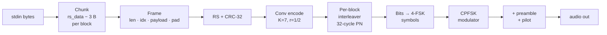
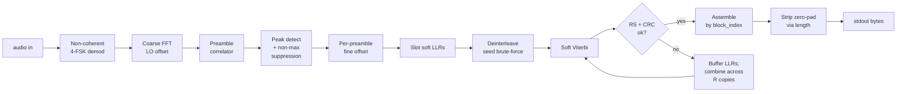

# weaklink

Streaming digital modem: bytes on stdin → audio → bytes on stdout. Works
with `tail -f`; no memory buffering, no wait-for-EOF. RS + convolutional
+ soft Viterbi outer/inner coding, per-block interleaver, cross-copy
soft-LLR combining. Modes: **OOK (1-tone)** through **16-FSK**, at
**45 / 300 / 1200 baud**.


Distribution: `weaklink-modem` (PyPI + release binaries).

---

## Install

Portable Linux binary:

```bash
sudo apt install libportaudio2 libsndfile1
curl -L -O https://github.com/ivica3730k/weaklink-9a3ice/releases/latest/download/weaklink-modem-linux-x86_64-latest
chmod +x weaklink-modem-linux-x86_64-latest
```

Debian / Ubuntu `.deb`:

```bash
curl -L -O https://github.com/ivica3730k/weaklink-9a3ice/releases/latest/download/weaklink-modem_amd64-latest.deb
sudo dpkg -i weaklink-modem_amd64-latest.deb
```

From source:

```bash
poetry install
poetry run weaklink-modem --version
```

PyPI:

```bash
pip install weaklink-modem
```

---

## Quickstart

```bash
# WAV roundtrip
echo -n "hello weaklink" | weaklink-modem tx --modem-wav /tmp/hello.wav
weaklink-modem rx --modem-wav /tmp/hello.wav

# Live speaker → mic
weaklink-modem rx > out.txt &
echo -n "over the room" | weaklink-modem tx

# Long-lived stream
tail -f /var/log/syslog | weaklink-modem tx --modem-baud 300
```

Both sides must use the same `--modem-baud` (no handshake).

---

## Presets

The three baud rates below are **presets** — starting points, not
fixed configurations. Every preset carries 13 B of payload per RS
block (RS(16,8) + CRC-32) by default, so message sizes and per-block
air time in the table are what you get if you don't override anything.
Preset defaults use 4-FSK; every other mode (`--modem-num-tones` ∈
{1, 2, 4, 8, 16}, OOK through 16-FSK) is available at any baud.

Every parameter shown is overridable on both sides via CLI flags
(`--modem-num-tones`, `--modem-rs-data-bytes`, `--modem-rs-parity-bytes`,
`--modem-block-repeats`, ...), or via `ModemOptions` in the Python
API. Changing them shifts the numbers in the table proportionally --
smaller RS blocks and lower repeat counts mean shorter minimum
payloads (and a worse cliff); the reverse is also true.

| Baud | CLI (both tx / rx) | 4-FSK tones (Hz) | Bandwidth | Default repeats | Measured best SNR | Min live tx (13 B payload) |
|---:|---|---|---:|---:|---:|---:|
| 45 | `--modem-baud 45` | 1200 / 1400 / 1600 / 1800 | 600 Hz | 4× | ≈ −14 dB | 28 s |
| 300 | `--modem-baud 300` | 1050 / 1350 / 1650 / 1950 | 900 Hz | 2× | ≈ −5 dB | 2.4 s |
| 1200 | `--modem-baud 1200` | 500 / 1700 / 2900 / 4100 | 3600 Hz | 2× | ≈ +2 dB | 1.0 s |

SNR is measured with AWGN normalised to a 3 kHz reference band — a
cross-baud comparison convention, not a physical channel filter.

Doubling `--modem-block-repeats` buys ~2–3 dB via soft-LLR combining
at proportional air time. Full sweep of every combo we test is in
[`results.md`](results.md).

### OOK / 1-tone mode

`--modem-num-tones 1` selects on-off keying: single carrier at
`center_hz`, symbol 0 = silence, symbol 1 = tone. Narrowest possible
bandwidth of any mode (no tone stack — just the carrier and its
modulation sidelobes) and Class-E-amp friendly since the amp only
sees on/off and never has to be linear. Same 1 bit/symbol as 2-FSK
but a few dB worse in AWGN — the trade you make for the narrow
spectrum. Cliff at 45 baud with `block_repeats=4`: ≈ −14 dB, matching
4-FSK at the same settings. See [`results.md`](results.md) for the
per-baud numbers.

### One tone at a time (constant envelope, any N)

Every mode in this modem is **single-tone-at-a-time CPFSK**.
`--modem-num-tones 16` means "16 possible frequencies to pick from
per symbol", **not** "16 frequencies playing simultaneously". The
transmitter emits exactly one sinusoid at any instant, hopping between
frequencies at the symbol clock. Constant envelope (PAPR = 3 dB, the
peak-to-RMS of a pure sine) regardless of N, so every mode runs on a
switching amp (Class-E, Class-D) — the amp only ever sees a single
carrier.

Time-frequency view of a 4-FSK burst — each cell is one symbol:

```
freq
 ↑
 F₃ │        ██                    ██
 F₂ │              ██                          ██
 F₁ │  ██                    ██
 F₀ │                    ██
    └────────────────────────────────────────→ time
       s₀    s₁    s₂    s₃    s₄    s₅    s₆

At any single instant: one tone on the air, full amplitude.
Over time: hops through all 4 slots. PAPR = 3 dB, always.
```

vs. what parallel multi-tone (OFDM-style; **not** this modem) would do:

```
freq
 ↑
 F₃ │  ██  ██  ██  ██  ██
 F₂ │  ██  ██  ██  ██  ██   N tones summed at each instant.
 F₁ │  ██  ██  ██  ██  ██   PAPR grows with N (~10·log₁₀(N)).
 F₀ │  ██  ██  ██  ██  ██   Requires linear amp — no Class-E.
    └───────────────────────→ time
```

Why single-tone:

- **Class-E / Class-D compatible** — switching amps stay efficient because the amp never sees more than one carrier.
- **All transmit power in one tone at a time** — maximum per-symbol SNR, no `1/N` power split across a stack.
- **Higher N buys log₂(N) bits/symbol** (more throughput) without any PAPR cost. 16-FSK carries 4× the bits of 2-FSK at the same baud, same peak power, same amp headroom.

On an SDR waterfall you'll see all N frequency slots "lit up" during a long transmission — that's the display integrating over time, showing every slot the modem visited. Zoom the FFT window below one symbol duration (~3.3 ms at 300 baud) and you'll see the transmitter chasing one tone across the slots instead.

---

## Debugging live audio

`weaklink-modem rx --modem-debug > out.txt` writes diagnostics to
`log.txt` (stdout stays clean for piping). Watch for:

- `audio: peak +X dBFS` below −40 dBFS → wrong mic or gain too low.
- `RS corrected` — outer code saved a block.
- `N slot(s) failed CRC/RS` — unrecoverable, data lost.
- macOS mic AGC / voice-isolation destroys tones; disable in System Settings.

---

## Full SNR sweep

Every baud × num_tones × RS × repeats combo is measured in
[`results.md`](results.md). Re-run `poetry run weaklink-modem-benchmark` to
refresh.

---

## Supported audio backends

| Backend | Linux | macOS | Windows | Notes |
|---|:---:|:---:|:---:|---|
| sounddevice / PortAudio | ✓ | ✓ | ✓* | Default. Index (`5`) or name substring (`USB`). WASAPI / CoreAudio / ALSA under the hood. |
| Pulse / PipeWire subprocess | ✓ | — | — | `paplay` / `parec`. Fires on `pulse:<id>`, `pulse:<name>`, a bare Pulse sink id resolvable by `pactl`, or a name PortAudio doesn't know (e.g. `virt.monitor`). |
| WAV via soundfile | ✓ | ✓ | ✓ | File I/O only, via `--modem-wav`. |

`*` Windows is untested — PortAudio supports it so it should work, but no CI on that platform yet.

---

## CLI reference

| Flag | Default | Description |
|------|---------|-------------|
| `--modem-baud N` | `300` | Symbol rate. Only `45`, `300`, `1200` supported. |
| `--modem-num-tones N` | `4` | N-FSK order: 2 / 4 / 8 / 16. Higher packs more bits per symbol at wider bandwidth and worse cliff. 2 halves throughput but fits narrow audio paths (e.g. FM voice via SignaLink). TX and RX must match. |
| `--modem-rs-data-bytes N` | preset | Reed-Solomon data bytes per block. |
| `--modem-rs-parity-bytes N` | preset | RS parity bytes. Corrects up to N/2 byte errors per block. |
| `--modem-no-rs-crc` | CRC on | Skip the CRC-32 inside each RS block. |
| `--modem-block-repeats N` | preset | N copies per block, each permuted differently; RX soft-combines LLRs. |
| `--modem-wav PATH` | live | WAV file instead of live audio. |
| `--modem-audio-output NAME` | OS default | tx audio target: sounddevice index, name substring, or Pulse sink. |
| `--modem-audio-input NAME` | OS default | rx audio source: same syntax; Pulse sources like `virt.monitor` supported. |
| `--modem-debug` | off | Verbose DEBUG chatter in the log file. |
| `--modem-log-file PATH` | `./log.txt` | Diagnostics land here. |

---

## How it works

### TX signal chain



### RX signal chain



Every slot is bracketed by a preamble, so any single slot decodes
standalone. Spurious mid-stream peaks get dropped. Message boundaries
between separate tx sessions are inferred from non-block-length spans
between preambles — one rx pipe can watch many tx sessions in a row.

### Wire format

```
One tx session (live audio):

  ┌────────┬─────┬────────┬─────┬────────┬─────┬─────┬────────┬─────┬────────┐
  │ pilot  │ pre │ slot 0 │ pre │ slot 1 │ pre │ ... │slot N-1│ pre │ pilot  │
  └────────┴─────┴────────┴─────┴────────┴─────┴─────┴────────┴─────┴────────┘

One RS block, data area (before conv + interleave + FSK):

  ┌── 1B ──┬── 2B ────┬──── rs_data − 3 B ────┬── 4B CRC ──┬── rs_parity B ──┐
  │ length │block_idx │ payload (zero-padded) │  CRC-32    │  RS parity      │
  └────────┴──────────┴───────────────────────┴────────────┴─────────────────┘
```

`block_idx` is 2 bytes → one tx session is bounded at 65 535 slots.

---

## Testing

```bash
poetry run pytest -q            # ~2 min, full suite
```

Every batch-decode test has an e2e-streaming companion that drives audio
through the same `_StreamingRxPump` the CLI uses.

---

## Glossary

- **N-FSK / CPFSK** — N continuous-phase tones, log₂(N) bits per symbol. Default N=4.
- **OOK** — On-off keying. `num_tones=1` mode: single carrier, symbol 0 = silence, symbol 1 = tone. 1 bit/symbol like 2-FSK but at the narrowest possible bandwidth (only the carrier + modulation sidelobes). Class-E-amp friendly (no linearity requirement). Pays a few dB vs 2-FSK in AWGN.
- **Preamble** — Fixed 32-symbol PN sequence bracketing every slot; RX locks timing / frequency / amplitude from it.
- **Slot** — Preamble + one RS-encoded block.
- **Block** — RS-encoded chunk carrying header + payload.
- **RS(n,k)** — Reed-Solomon outer code. k data + parity → n wire bytes; corrects (n-k)/2 byte errors.
- **CRC-32** — Catches errors past RS correction.
- **Convolutional code (K=7, r=1/2) + soft Viterbi** — Inner FEC and its decoder, driven by per-bit LLRs.
- **LLR** — Log-likelihood ratio; a soft (real-valued) confidence per bit instead of a hard 0/1.
- **Interleaver** — Bit shuffle so bursts become isolated errors. Ours changes every block (32-permutation cycle).
- **Non-coherent demod** — Tone detection by energy; ~3 dB behind coherent.
- **LO offset** — Radio frequency error; we correct up to ±500 Hz.
- **Pilot** — Short random N-FSK burst before / after every live TX.
- **SNR (dB)** — Signal-to-noise ratio. Negative = noise louder than signal.
- **AWGN** — Additive white Gaussian noise; the standard clean-channel noise model used by the benchmark.
- **Shannon limit** — Theoretical lowest SNR at which a given data rate can be decoded error-free. Every FEC decoder sits some dB above it — that gap is what "Gap" columns report.
- **Best SNR / cliff** — Lowest SNR at which decode still works for a given config. Below it, everything breaks.
- **Nyquist theorem** — A signal is only recoverable if sampled above twice its highest frequency. In practice: tones must sit below sample_rate/2, and N-FSK tone spacing must be at least `1/T_symbol` for non-coherent orthogonality.

---

## Roadmap

- **Coherent detection** — Costas-loop demod, ~3 dB gain. Big DSP lift.
- **LDPC** — Closes ~2–4 dB of the Shannon gap. Needs a proper construction.

---

## License

MIT. See `LICENSE`.

Reed-Solomon via [`reedsolo`](https://github.com/tomerfiliba-org/reedsolomon).
Convolutional code uses the standard NASA/CCSDS (171, 133) generator
polynomials. Audio via [`sounddevice`](https://github.com/spatialaudio/python-sounddevice)
and [`soundfile`](https://github.com/bastibe/python-soundfile).
